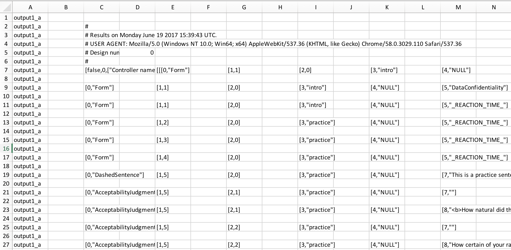
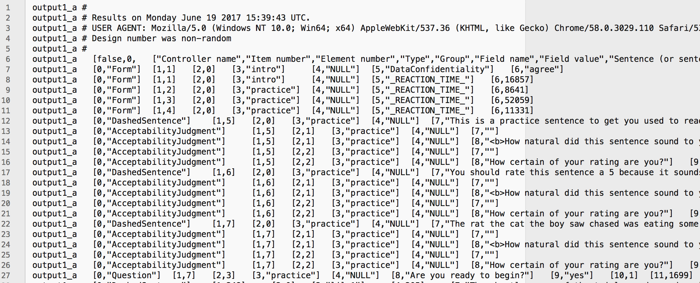

In this tutorial, we will take the output of an [Ibex Farm](http://spellout.net/ibexfarm/) experiment and process it into a form that we can analyse in [R](https://www.stats.bris.ac.uk/R/). The code in this tutorial is adapted from code by [Laurel E. Brehm](http://www.mpi.nl/people/brehm-laurel-ellen/research). It's a unix `bash` script, which can be run in **Terminal** on a Mac (and possibly **Console** on Windows, though [I haven't tested it yet](https://docs.microsoft.com/en-us/windows/wsl/install-win10), but I hear [cygwin](https://www.cygwin.com/) is a good way to do it).

# Downloading your data…

At the end of gathering data, you will have several files in the **results** section of your experiment(s). You only need the raw_results files in order to process your data, but it's good to archive and preserve the whole experiment in its end state, so I recommend that you download the entire experiment by clicking on the link for the **zip archive**.


# Prep file(s) for processing…

The format of the raw_results files is not in an easy form to deal with, so we must do a few things to them. First, we need to change directory (`cd`) so that we're working in the same folder that your downloaded archives are located.

```{bash eval=FALSE}
#### shell scripts for dealign with IBEX data
## LEB fall/winter 2016; LMA summer 2017
## to move files out of folders:

## logic: enter directory, grab the thing in a sub-directory, and pull it out to bigger directory
cd /Users/yourcomputer/Documents/Experiments/Experiment_Folder
```

Next, we want to *copy* them to a new location so that we don't accidentally mess them up and lose or damage our data. This will also add a file extension to the file name. Each line of code says to *move* `mv` the file located at the specified path to a new file named something like `output.txt`. Since this example experiment had eight lists (i.e., eight separate entries in Ibex Farm), we need to do this eight times. You might only need to do this once, though. (After this next cell of code, I'll only show you code for `output1.txt`, so you would need to repeat this with the seven other file names if you had eight total files.)

```{bash eval=FALSE}
mv ibex-1/results/raw_results output1.txt
mv ibex-2/results/raw_results output2.txt
mv ibex-3/results/raw_results output3.txt
mv ibex-4/results/raw_results output4.txt
mv ibex-5/results/raw_results output5.txt
mv ibex-6/results/raw_results output6.txt
mv ibex-7/results/raw_results output7.txt
mv ibex-8/results/raw_results output8.txt

## (there were many files… and so forth)
```

Now we need to do some manipulation of the text *inside* the file. Since these operations aren't reversible, we want to make sure we aren't messing up your original files. To do that, we'll duplicate the file with *copy* `cp` before we make any changes.

```{bash eval=FALSE}
### reformat files to be ‘long’ & append list info
## logic: for each file, replace the IBEX delmiters (which is to say: ]],[[ signifies end of element in )

## copy original file to something new
cp output1.txt output1-2.txt

## use ‘sed’ to substitute patterns of brackets and commas in the copied file with ++ (which are the ones between trials and should turn to new lines) and == (which are between elements of a trial, should be treated as tabs)
## \[ means treat as the special character [
## this is done in 2 steps because of how shell handles special characters

sed -i '' -e  's/+ + + //g'  output1-2.txt
sed -i '' -e  's/\]\],\[\[/\]++\[/g'  output1-2.txt
sed -i '' -e  's/\],\[/\]==\[/g'  output1-2.txt

## then use ‘tr’ to cover the ++ and == to new line and tab
## creates 2 new files because tr doesn’t handle in-file replacements well

tr '++' '
' < output1-2.txt > output1-3.txt 

sed -i '' -e 's/^/output1_a==/' output1-3.txt

tr '==' '\t' < output1-3.txt > output1-X.txt 

## now get rid of the new files we added that are intermediate products
rm output1-2.txt
rm output1-3.txt

```

If you've got multiple output files, repeat the previous block for each of them (changing `output1-2.txt` to `output2-2.txt`, etc…). Make sure you change *each* of the instances of the file name, otherwise the code won't work. It might make sense to paste the code into a text editor like [**TextWrangler**](https://www.macupdate.com/app/mac/11009/textwrangler) or [**Notepad++**](https://notepad-plus-plus.org/) and do a *Find and Replace* operation for the file names.

```{bash eval=FALSE}
#### once we do that for all of the files, combine them!
### concatenate all files in the current directory ending in X.txt  
cat *X.txt > output_data2.txt
```


```{bash eval=FALSE}
### now we can remove X.txt files
rm *X.txt
```

# Identifying columns…

This is where things get tricky.

Depending on how you structured your Ibex Farm experiment, your results file will have a slightly different structure. This means you'll have to dig into the `output_data.txt` file to figure out what columns you actually need. Alternatively, you could extract all columns, but that will produce a lot of junk you'll have to sort through later. For instance, some columns are empty. Typically even-numbered columns are blank, unless you have certain types of data in your experiment (e.g., sliding scales). This is why you must learn how to navigate the raw structure of the data, at least a little bit.


The first column has the text `output1_a`, indicating it was taken from the file `output1.txt`. That's also *column 1* (`$1`). Column 2 `$2` is blank, which is the white space after the first bit of text. The third column contains all the text that begins with `#`, as well as all the text of the form `[0,"*****"]`. The `0` indicates this is the first index of Ibex Farm information, but that's not how it's formatted. This gets confusing quickly, so I will differentiate between Ibex Farm indicies `[0]` and actual interpretable column numbers `$0` in this way from now on.

One way to figure out what columns you need is to open the file in a spreadsheet (e.g., Excel). Given what we see here, it looks like only odd numbered columns have text, but if we explored further down, we'd see that columns `$16`, `$18`, and `$20` also have useful information in them sometimes.



Before we can really make much progress, though, we also need to get rid of the empty *rows*, which take up a lot of space and don't contribute anything to our data structure.

As is stated in the code below, `$4` also has text in it, but since we don't need that, we can exclude it. Here's how to interpret the first line of code:

* `awk` is the command
* `-F'\t'` specifies that it's a tab delimited file
* `$3!=""` tells the script to only include rows in which column 3 is not empty.
    + `$3` column 3
    + `!=` is not
    + `""` empty
* `{print …}` tells the script to output contents of the columns listed

The next two lines of code go through and make the file readable by ensuring all the tab delimitations and braces still exist in the right places.

(If you're interested in learning more about this type of text processing, [here](http://tldp.org/LDP/abs/html/sedawk.html) is a primer.)

The final line of code removes the intermediate stage file so that we're left with `output_data.txt`.

```{bash eval=FALSE}
## get rid of all the empty rows; for some reason only odd columns and $4 have text; 4 isn't useful
## MAKE SURE YOU KNOW HOW MANY COLUMNS (and which ones) YOU WILL NEED
awk -F'\t' '$3!="" {print $1,$3,$5,$7,$9,$11,$13,$15,$16,$17,$18,$19,$20,$21}' output_data2.txt > output_data4.txt
sed -i '' -e  's/\[/+\[/g'  output_data4.txt
tr '+' '\t' < output_data4.txt > output_data.txt 
rm output_data4.txt
```

This produces a file that looks more orderly, but we're not there yet.



We still have all of those Ibex Farm indices that we don't actually need. Once we've figured out which index corresponds to which kind of information, we can make a note of that and remove the extra characters. However, we should be careful about the order in which we do this because numbers like 10 start with a 1, so operating on 1 before 10 means that we'll operate on both…

* `[0]` contains the type of input (Form, AcceptabilityJudgment, DashedSentence, Question, Scale, etc…)
* `[1]` contains the token number (a unique identifier for the input, independent of randomisation)
* `[2]` contains the item number
* `[3]` contains the category of the item (e.g., "practice", "demographics", "experiment1", etc…)
* `[4]` contains information about whether the answer is 'correct' (if specified)
* `[5]` contains the type of information recorded, but this isn't always present
* `[6]` contains the reaction time or response (e.g., "agree"), depending on item category in `[3]`
* `[7]` contains an empty field indicating a click to continue
* `[8]` contains the text of the question
* etc… (you will have to interpret your columns on your own, since the content depends on what kind of design you used)

```{bash eval=FALSE}
## subsetting with ‘awk’:
## -F’\t’ specifies that it’s tab delimited
## $NUMBER is the whateverth column
## pull out consent info and use this to merge in later

cp output_data.txt output_data_test.txt
sed -i '' -e  's/11,//g'  output_data_test.txt
sed -i '' -e  's/12,//g'  output_data_test.txt
sed -i '' -e  's/13,//g'  output_data_test.txt
sed -i '' -e  's/14,//g'  output_data_test.txt
sed -i '' -e  's/15,//g'  output_data_test.txt
sed -i '' -e  's/16,//g'  output_data_test.txt
sed -i '' -e  's/17,//g'  output_data_test.txt
sed -i '' -e  's/18,//g'  output_data_test.txt
sed -i '' -e  's/19,//g'  output_data_test.txt
sed -i '' -e  's/10,//g'  output_data_test.txt
sed -i '' -e  's/1,//g'  output_data_test.txt
sed -i '' -e  's/2,//g'  output_data_test.txt
sed -i '' -e  's/3,//g'  output_data_test.txt
sed -i '' -e  's/4,//g'  output_data_test.txt
sed -i '' -e  's/5,//g'  output_data_test.txt
sed -i '' -e  's/6,//g'  output_data_test.txt
sed -i '' -e  's/7,//g'  output_data_test.txt
sed -i '' -e  's/8,//g'  output_data_test.txt
sed -i '' -e  's/9,//g'  output_data_test.txt
sed -i '' -e  's/0,//g'  output_data_test.txt
sed -i '' -e  's/" /"/g'  output_data_test.txt 
sed -i '' -e  's/"//g'  output_data_test.txt
```

Now we're left with a slightly less informative but much cleaner file. I've put tab delimited column numbers on the first row of this file so I could view it in a spreadsheet to figure out which columns contain what type of content, since this varies by item category. 

I've also done some hand-processing in Excel (forgive me!) to add subject numbers and file numbers. These are the values immediately following `output1_a`. There is definitely an automated way to do this, but I kept messing it up and gave up. I'll update this page if I ever figure out how to do it automatically.


# Subsetting your data…

One of the main features of Ibex Farm output is that all types of responses are recorded, but they're labeled differently. This means that the output file we've been working with is a patchwork of different types of information. In order to turn the output into something we can read in R, we will need to separate out the different types of responses.

## Examples

The following cells of code are examples of how you might turn your output into something readable into R. You can play around with them and tweak them for your own purposes. Make sure you *carefully* choose the columns you'll need for each, as they might differ for you.

In these examples, column `$4` has the item category, so we can subset each type of output by changing the `*****` in `$4=="\[*****\]"` to the relevant text.

***

### Comprehension questions 

```{base eval=FALSE}
## file with subject and items added: 20170718_data-with-subj-list.txt (copied into output_data_test jsyk)
## check for white spaces after brackets
## extract comprehension questions
awk -F'\t' '$4=="\[Question\]" {print $2,$3,$5,$7,$8,$9,$10,$11,$12}' output_data_test.txt > output_Questions2.txt
sed -i '' -e  's/\] \[/+/g'  output_Questions2.txt
sed -i '' -e  's/\]//g'  output_Questions2.txt
sed -i '' -e  's/\[//g'  output_Questions2.txt
tr '+' '\t' < output_Questions2.txt > output_Questions.txt
rm output_Questions2.txt
```

Note the columns we're extracting here. We don't need all of them, and some aren't relevant to the `Question` category.

***

### Acceptablity (naturalness) questions 

```{bash eval=FALSE}
## extract naturalness questions
awk -F'\t' '$4=="\[AcceptabilityJudgment\]" {print $2,$3,$5,$6,$7,$8,$9,$10,$12}' output_data_test.txt > output_AJ1.txt
sed -i '' -e  's/\] \[/\]+\[/g'  output_AJ1.txt
tr '+' '\t' < output_AJ1.txt > output_AJ2.txt
awk -F'\t' '$7=="\[How natural did this sentence sound to you?\]" {print $1,$2,$3,$5,$6,$8,$9}' output_AJ2.txt > output_AJ3.txt
sed -i '' -e  's/\] \[/+/g'  output_AJ3.txt
sed -i '' -e  's/\]//g'  output_AJ3.txt
sed -i '' -e  's/\[//g'  output_AJ3.txt
tr '+' '\t' < output_AJ3.txt > output_AJ_nat.txt
rm output_AJ1.txt
rm output_AJ2.txt
rm output_AJ3.txt
```

This subsetting operation requires two subsets because there are two different types of `AcceptabilityJudgment` items. Column `$4` contains all `AcceptabilityJudgment` rows, but we only want the ones that were naturalness ratings, so we then subset out rows with column `$7` containing the text used only in naturalness rating items.

***

### Confidence questions 

```{bash eval=FALSE}
## extract confidence questions
awk -F'\t' '$4=="\[AcceptabilityJudgment\]" {print $2,$3,$5,$6,$7,$8,$9,$10,$12}' output_data_test.txt > output_AJ1.txt
sed -i '' -e  's/\] \[/\]+\[/g'  output_AJ1.txt
tr '+' '\t' < output_AJ1.txt > output_AJ2.txt
awk -F'\t' '$7=="\[How certain of your rating are you?\]" {print $1,$2,$3,$5,$6,$8,$9}' output_AJ2.txt > output_AJ3.txt
sed -i '' -e  's/\] \[/+/g'  output_AJ3.txt
sed -i '' -e  's/\]//g'  output_AJ3.txt
sed -i '' -e  's/\[//g'  output_AJ3.txt
tr '+' '\t' < output_AJ3.txt > output_AJ_conf.txt
rm output_AJ1.txt
rm output_AJ2.txt
rm output_AJ3.txt
```

This subsetting operation requires two subsets because there are two different types of `AcceptabilityJudgment` items. Column `$4` contains all `AcceptabilityJudgment` rows, but we only want the ones that were confidence ratings, so we then subset out rows with column `$7` containing the text used only in confidence rating items.

***

### Demographic questions 

```{bash eval=FALSE}
## extract demographic questions
awk -F'\t' '$4=="\[Form\]" {print $2,$3,$5,$9,$10}' output_data_test.txt > output_demog1.txt
sed -i '' -e  's/\] \[/\]+\[/g'  output_demog1.txt
tr '+' '\t' < output_demog1.txt > output_demog2.txt
awk -F'\t' '$4!="\[\_REACTION\_TIME\_\]" {print $1,$2,$3,$4,$5}' output_demog2.txt > output_demog3.txt
sed -i '' -e  's/\] \[/+/g'  output_demog3.txt
sed -i '' -e  's/\]//g'  output_demog3.txt
sed -i '' -e  's/\[//g'  output_demog3.txt
tr '+' '\t' < output_demog3.txt > output_demog.txt
rm output_demog1.txt
rm output_demog2.txt
rm output_demog3.txt
```

This subsetting operation requires two subsets because there are multiple types of `Form` items. Column `$4` contains all `Form` rows, but we only want the ones that are not reaction times, so we then subset out rows with column `$7` that *do not* contain the text used only in reaction time rows.

***

### Sliding scale questions 

```{bash eval=FALSE}
## extract scale questions
awk -F'\t' '$4=="\[Scale\]" {print $2,$3,$5,$9,$12}' output_data_test.txt > output_demog1.txt
sed -i '' -e  's/\] \[/\]+\[/g'  output_demog1.txt
tr '+' '\t' < output_demog1.txt > output_demog2.txt
awk -F'\t' '$4!="\[\_REACTION\_TIME\_\]" {print $1,$2,$3,$4,$5}' output_demog2.txt > output_demog3.txt
sed -i '' -e  's/\] \[/+/g'  output_demog3.txt
sed -i '' -e  's/\]//g'  output_demog3.txt
sed -i '' -e  's/\[//g'  output_demog3.txt
tr '+' '\t' < output_demog3.txt > output_demog-scale.txt
rm output_demog1.txt
rm output_demog2.txt
rm output_demog3.txt
```

***

### Self-Paced Reading (SPR) times

```{bash eval=FALSE}
## extract reading times
awk -F'\t' '$4=="\[DashedSentence\]" {print $2,$3,$5,$7,$8,$9,$10,$11,$12,$13}' output_data_test.txt > output_spr1.txt
sed -i '' -e  's/\] \[/\]+\[/g'  output_spr1.txt
tr '+' '\t' < output_AJ1.txt > output_spr2.txt
sed -i '' -e  's/\] \[/+/g'  output_spr2.txt
sed -i '' -e  's/\]//g'  output_spr2.txt
sed -i '' -e  's/\[//g'  output_spr2.txt
tr '+' '\t' < output_spr2.txt > output_spr.txt
rm output_spr1.txt
rm output_spr2.txt
rm output_spr3.txt
```

***

### Autism Quotient (AQ) questions 

```{bash eval=FALSE}
## extract AQ
awk -F'\t' '$7=="\[aq\]" {print $2,$3,$5,$6,$7,$8,$9,$10,$12}' output_data_test.txt > output_AQ1.txt
sed -i '' -e  's/\] \[/\]+\[/g'  output_AQ1.txt
tr '+' '\t' < output_AQ1.txt > output_AQ2.txt
awk -F'\t' '$5=="\[aq\]" {print $1,$2,$6,$8,$9}' output_AQ2.txt > output_AQ3.txt
sed -i '' -e  's/\] \[/+/g'  output_AQ3.txt
sed -i '' -e  's/\]//g'  output_AQ3.txt
sed -i '' -e  's/\[//g'  output_AQ3.txt
tr '+' '\t' < output_AQ3.txt > output_AQ.txt
rm output_AQ1.txt
rm output_AQ2.txt
rm output_AQ3.txt
```

***

# Combining the subsets…

You'll want to combine the subsets in a way that makes sense to you and to your analysis. You may want to create several different datasets, or one large one. However, you should be mindful of how many ways you combine your data so that you don't accidentally over-analyse it. 

(For instance, if you want to check how acceptability ratings and reading times are related, you may have a column for each, but that would duplicate the ratings over each reading time within the sentence. To analyse reading times independently, you must ensure you only analyse one rating per sentence, not one rating per region per sentence.)

Here is one way you might structure your demographic data and add it to your acceptability judgment data in R:

```{r eval=FALSE}
# read in demographic data as a data frame
df.demog <- read.delim("output_demog.txt",header=TRUE,as.is=TRUE)
# make sure the open-ended gender questions are capitalised consistently
df.demog$answer[df.demog$answer=="Female"] <- "female"
df.demog$answer[df.demog$answer=="Male"] <- "male"

# read in acceptability rating data
df.judge <- read.delim("output_AJ_nat.txt",header=TRUE,as.is=TRUE)
# turn condition numbers into something interpretable and consistent, assuming 4 conditions
## %% is the 'modulo' operator
df.judge$cond.num <- NA
df.judge$cond.num[df.judge$exp=="cona"] <- ((df.judge$itNo[df.judge$exp=="cona"]-5) %% 4) +1
df.judge$cond.num[df.judge$exp=="attr"] <- ((df.judge$itNo[df.judge$exp=="attr"]-5) %% 4) +1
df.judge$cond.num[df.judge$exp=="lily"] <- ((df.judge$itNo[df.judge$exp=="lily"]-5) %% 2) +1
df.judge$cond.num[df.judge$exp=="doso"] <- ((df.judge$itNo[df.judge$exp=="doso"]-5) %% 12) +1

# add demographic data to acceptability judgement data (already read in as df.judge)
df.judge$age <- NA
df.judge$gend <- NA
df.judge$edu <- NA
for (i in 1:max(df.judge$subj)) {
  df.judge$age[df.judge$subj==i] <-    demogSpr$answer[demogSpr$question=="age"&demogSpr$subj==i]
  df.judge$gend[df.judge$subj==i] <-   demogSpr$answer[demogSpr$question=="gender"&demogSpr$subj==i]
  df.judge$edu[df.judge$subj==i] <-    demogSpr$answer[demogSpr$question=="education"&demogSpr$subj==i]
}
df.judge$age <- as.numeric(df.judge$age)
```

More information available in the Advanced Statistics tutorial coming later this year…
