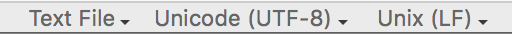
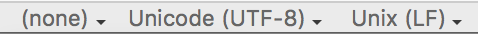

[🔙 Home](https://verbingnouns.github.io/notebooks/)

All work associated with the [Centre for Behaviour and Evolution](http://www.ncl.ac.uk/cbe/), including this documentation, is supported by a Wellcome Trust Capital Award to Newcastle (grant ref: 092504).

````{r, echo=FALSE,message=FALSE}
library(reticulate)
use_python(python="/usr/local/bin/python3", required = TRUE) # this needs to be FIRST because only one version can be loaded per R session
````

# Purpose

This notebook goes through pre-processing data from an EyeLink 1000 running [EyeTrack](https://blogs.umass.edu/eyelab/software/). 

## Technical Specifications

* [EyeLink 1000](https://docs.google.com/document/d/1Hs2Yb06wP5O9qL43MpE4gyacLzw7oHaIc18xC4fK6Mw/edit?usp=sharing) location in the [Institute of Neuroscience](http://www.ncl.ac.uk/ion/) in the Henry Wellcome Building, Newcastle University
* [EyeTrack](https://blogs.umass.edu/eyelab/software/) software developed and hosted by UMass Amherst
    - using a Gravis Destroyer control pad ([additional specs](https://docs.google.com/document/d/1YvIWxzPpiQUZDlA1RjCPOe4qhINz9hPEJr9lH6Z2alM/edit?usp=sharing))

# fix_align_v0p92.R

This section takes the prose information from Cohen (2013) and puts in it lists for quick accessibility. 

> Cohen, Andrew L. (2013). Software for the automatic correction of recorded eye fixation locations in reading experiments. *Behavior research methods*, 45(3), 679--683. Accessed from: [https://people.umass.edu/eyelab/CohenBRM.pdf](https://people.umass.edu/eyelab/CohenBRM.pdf)


## Understanding the function

In order to use fix_align properly, it's good to understand what arguments it takes and what it does with those arguments. I present information condensed from Cohen (2013) and my own interpretations and experiences with using it.

````{r}
library(knitr)
source('fix_align_v0p92.R')
````

````
fix_align <- function(start_pts,                      # where does each line start
                      asc_files         = '.',        # where are the files
                      xy_bounds         = NULL,       # remove points before calculating regression
                      keep_y_var        = FALSE,      # TRUE: residual for its regression is kept
                      use_run_rule      = TRUE,       # 
                      trial_plots       = TRUE,       # 
                      save_trial_plots  = FALSE,      # .tiff plots saved in directory “Trial_Plots”
                      summary_file      = TRUE,       # TRUE: a .fas is saved in fa_dir
                      show_image        = FALSE,      # TRUE: trials on top of background images
                      fa_dir            = 'FA_Dir',   # where are the .asc files?
                      start_flag        = 'TRIALID',  # what do trials start with?
                      den_sd_cutoff     = Inf,        # remove outliers
                      den_ratio_cutoff  = 1,          # remove outliers
                      k_bounds          = c(-.1, .1), # NULL = 0; min/max of regression slope
                      o_bounds          = c(-50, 50), # NULL = 0; min/max of vertical offset
                      s_bounds          = c(1, 20))   # min/max of sd
````

### Input

Taken directly from Cohen (2013):

* `start_pts` is an n × 2 matrix that defines the x and y locations of the start of each text line, where n is the number of text lines.
* `asc_files` is a vector of .asc file names and/or folders containing .asc files.
* Any points outside the rectangles provided by `xy_bounds` are considered out of bounds and are removed from the analysis before the regression lines are determined.
* `xy_bounds` provides a way to remove points from analysis a priori. 
    - Any points outside the rectangles provided by `xy_bounds` are considered out of bounds and are removed from analysis before the regression lines are determined. 
    - All other points are included in the creation of the regression lines. 
    - The bounds can be set to no bounds (`NULL`), a single rectangle for the entire experiment (a 1 × 4 vector: x-min, x-max, ymin, and y-max), or one rectangle per trial (an n × 4 matrix of rectangles).
* If `keep_y_var` is set as `TRUE`, the residual of each fixation around its assigned regression line is kept when the y location is changed; otherwise, it is removed.
*  If `use_run_rule` is set as `TRUE`, ambiguous fixations are potentially reclassified by their surrounding fixations as described above; otherwise, they remain ambiguous.
* If `trial_plots` is set as `TRUE`, trial-by-trial plots of the original and reformatted fixations are shown.
* If `save_trial_plots` is set as `TRUE`, the trial plots are saved as .tiff files, in a subdirectory called “Trial_Plots” in the directory defined by `fa_dir`
    - In this case, the plots will only be saved—that is, they will not be shown on the screen.
    - <span style="color:blue">These files are massive, so do not use this option unless you are processing a small amount of data or have a lot of storage space.</span>
* If `summary_file` is set as `TRUE`, a .fas (fix align summary) file is created 
    - It saves the slope, vertical offset, standard deviation, regression fit, and the numbers of total, kept, out-of-bounds, ambiguous, outlier, and other fixations for each participant and each trial.
* If `show_image` is set as `TRUE`, the trial plots are shown on top of background images.
    - These background images are .tiff files located in the same directory as the data files. 
    - One image can be used per .asc file, or one image per trial per .asc file, and images must be saved as .tiff files with the same name as the .asc file and the .tiff ending. 
    - If one image is used per trial, the end of the name must have an underscore followed by a trial number (e.g., “_1” for Trial 1).
* `fa_dir` is the name of the directory used to store the reformatted .asc files, .fas files, and trial plots. 
    - The .asc files are marked by having “_fa” (fix align) at the ends of their names.
    - <span style="color:blue">This is hard-coded as `FA_Dir` thus should be set to the name of the actual directory.</span>
* `start_flag` is the text that marks the start of data collection in the .asc file, which will typically be either “TRIALID” or “SYNCTIME.”
* `den_sd_cutoff` defines the number of standard deviations from a regression line that determines an outlier.
* `den_ratio_cutoff` defines the ratio (in density) that determines ambiguous fixations.
* `k_bounds`, `o_bounds`, and `s_bounds` are 1×2 vectors that define the minimum and maximum values that the regression line slope, vertical offset, and standard deviation, respectively, can take. 
    - If set to `NULL`, `k_bounds` and `o_bounds` have values of 0.

An example input directly from Figure 2:

````
fix_align <- function(start_pts = rbind(c(27, 436), c(27, 556)),
                      asc_files = 'Data/23_50H_B.asc',
                      save_trial_plots = TRUE,
                      start_flag = 'SYNC_TIME',
                      den_sd_cutoff = 4.5,
                      den_ratio_cutoff = 55000)
````

If you don't want to remove any points:

````
den_sd_cutoff = Inf,
den_ratio_cutoff = 0
````

### Output

Adapted from Cohen (2013):

* A .tiff file
    - The trial-by-trial visualization of the fixation adjustment and classifications.
* A .fas (fix align summary) file 
    - Saves the slope, vertical offset, standard deviation, regression fit, and the numbers of total, kept, out-of-bounds, ambiguous, outlier, not-in-trial, and partial fixations for each participant and trial.
* The reformatted .asc file
    -  This file is a copy of the original .asc file, with the y locations of the fixations changed to reflect the regression analysis and fixation removal process.
    -  This file has the same name as the original .asc file, with “_fa” (fix align) added to the end.

## Practical application

In my .asc file, this is what the first few lines of a sample trial look like (the sentence-initial word "The").

````
INPUT	3589590	127
MSG	3589610 TRIALID E16I77D0
MSG	3589628 DISPLAY TEXT 1
MSG	3589628 REGION CHAR 0 1 T 67 267 79 319
MSG	3589629 DELAY 1 MS
MSG	3589629 REGION CHAR 1 1 h 79 267 91 319
MSG	3589631 DELAY 1 MS
MSG	3589631 REGION CHAR 2 1 e 91 267 103 319
MSG	3589632 DELAY 1 MS
MSG	3589633 REGION CHAR 3 1   103 267 115 319
MSG	3589634 DELAY 1 MS
````

It looks like `67` indicates the leftmost edge of the `T` and the `79` is the right most edge, since `79` is also the leftmost edge of `h`. That means values in these columns are the x-axis value. That makes `267` the top edge and `319` the bottom edge of the y-axis.

The break between the first and second line of text from this trial looks like this:

````
MSG	3589750 REGION CHAR 57 1 t 751 267 763 319
MSG	3589752 DELAY 1 MS
MSG	3589752 REGION CHAR 58 1 h 763 267 775 319
MSG	3589754 DELAY 1 MS
MSG	3589755 REGION CHAR 59 1 e 775 267 787 319
MSG	3589756 DELAY 1 MS
MSG	3589756 REGION CHAR 60 1   787 267 799 319
MSG	3589759 DELAY 1 MS
MSG	3589760 REGION CHAR 62 1 a 67 329 79 381
MSG	3589762 DELAY 1 MS
MSG	3589763 REGION CHAR 63 1 n 79 329 91 381
MSG	3589764 DELAY 1 MS
MSG	3589765 REGION CHAR 64 1 n 91 329 103 381
MSG	3589767 DELAY 1 MS
MSG	3589768 REGION CHAR 65 1 u 103 329 115 381
MSG	3589770 DELAY 1 MS
MSG	3589771 REGION CHAR 66 1 a 115 329 127 381
MSG	3589772 DELAY 1 MS
MSG	3589773 REGION CHAR 67 1 l 127 329 139 381
MSG	3589775 DELAY 1 MS
````

It looks like the x-axis values for the second line are the same as the first line, so our y-axis top edge is at `329` and the bottom edge is at `381`.

### Testing it out

Now I'll put in custom values for my files. I'm not sure which y-axis edges to use, so I'll go with the most extreme ones for each line. The x-axis will be the leftmost edge for both.

```{r, message=TRUE}
fix_align(start_pts = rbind(c(67, 267), c(67, 381)),
          asc_files = 'asc/PR02.asc',
          save_trial_plots = TRUE,
          fa_dir = 'asc',
          start_flag = 'TRIALID',
          den_sd_cutoff = Inf,
          den_ratio_cutoff = 0)
```

### Processing all files

Okay, that actually worked, but since it was one of the messier files, I want to try it with the average y-axis value.

* line 1 = `r mean(c(267,319))`
* line 2 = `r mean(c(329,381))`

I've also set `den_sd_cutoff` to 3, which has a slightly narrower band that's acceptable, and `den_ratio_cutoff` is set to 5 because large numbers throw out a LOT of points that are correctly categorized with small numbers. These numbers work fairly well with PR02.asc, so I will add in all the other files now. I've also set some `xy_bound` cutoff points to ignore outliers that are *definitely* outliers before calculating regression lines.

```{r, message=TRUE}
fix_align(start_pts = rbind(c(67, 293), c(67, 355)),
          asc_files = c(#'asc/PR01inc.asc',
                      'asc/PR02.asc',
                      'asc/PR03-1b.asc',
                      'asc/PR04.asc',
                      'asc/PR05.asc',
                      'asc/PR06.asc',
                      'asc/PR07.asc',
                      'asc/PR08.asc',
                      'asc/PR09.asc',
                      'asc/PR10.asc',
                      'asc/PR11.asc',
                      'asc/PR12.asc',
                      'asc/PR13.asc',
                      'asc/PR14.asc',
                      'asc/PR15.asc',
                      'asc/PR16.asc',
                      'asc/PR17.asc',
#                     'asc/PR18.asc',
                      'asc/PR19.asc',
                      'asc/PR20.asc',
                      'asc/PR21.asc',
                      'asc/PR22.asc',
                      'asc/PR23.asc',
                      'asc/PR25.asc',
                      'asc/PR27.asc',
                      'asc/PR28.asc',
                      'asc/PR29.asc',
                      'asc/PR30.asc',
#                     'asc/PR31.asc',
                      'asc/PR32.asc',
                      'asc/PR33.asc',
                      'asc/PR34.asc',
                      'asc/PR35.asc',
#                     'asc/PR36.asc',
                      'asc/PR38.asc',
                      'asc/PR39.asc',
#                     'asc/PR40.asc',
                      'asc/PR41.asc',
                      'asc/PR42.asc',
#                     'asc/PR43.asc', # Error in trial_fix[[i]] : subscript out of bounds
#                     'asc/PR44.asc', # Error in trial_id_start[t]:trial_end[t] : NA/NaN argument
                      'asc/PR45.asc',
                      'asc/PR46.asc',
                      'asc/PR47.asc',
#                     'asc/PR48.asc', # Error in trial_fix[[i]] : subscript out of bounds
                      'asc/PR49.asc',
                      'asc/PR50.asc',
                      'asc/PR51.asc',
                      'asc/PR52.asc',
                      'asc/PR53.asc'),
          xy_bounds = c(20, 1000, 200, 600), # c(x-min, x-max, ymin, y-max)
          trial_plots = FALSE, # i can't get this to do anything except spin its wheels?
          save_trial_plots = FALSE, # wow that takes up a LOT of space
          fa_dir = 'asc',
          start_flag = 'TRIALID',
          den_sd_cutoff = 3, # not sure what's best, but this seems to work okay
          den_ratio_cutoff = 5) # small numbers seem to do fine…?
```

There seemed to be some issues with `PR09` when I was still creating .tiff files, but a spot check make it look like 'weird' trials were mostly rejected rather than miscategorized (more often than not).

### Debugging problem files

These files throw errors and I'd like to know why. <span style="color:red">To do: follow up with Jesse Harris et al.</span>

```{r, message=TRUE}
fix_align(start_pts = rbind(c(67, 293), c(67, 355)),
          asc_files = c(#'asc/PR01inc.asc', # Error in trial_id_start[t]:trial_end[t] : NA/NaN argument
#                     'asc/PR18.asc'#,  Error in trial_id_start[t]:trial_end[t] : NA/NaN argument
#                     'asc/PR31.asc'#,  Error in trial_id_start[t]:trial_end[t] : NA/NaN argument
#                     'asc/PR36.asc'#,  Error in trial_id_start[t]:trial_end[t] : NA/NaN argument
#                     'asc/PR40.asc'#,  Error in if (trial_id_start[start_index + 1] < trial_end[end_index]) { : missing value where TRUE/FALSE needed
#                     'asc/PR43.asc'#,  Error in trial_fix[[i]] : subscript out of bounds
#                     'asc/PR44.asc'#,  Error in trial_id_start[t]:trial_end[t] : NA/NaN argument
#                     'asc/PR48.asc'#   Error in trial_fix[[i]] : subscript out of bounds
                      ),
          xy_bounds = c(20, 1000, 200, 600), # c(x-min, x-max, ymin, y-max)
          trial_plots = FALSE, # i can't get this to do anything except spin its wheels?
          save_trial_plots = FALSE, # wow that takes up a LOT of space
          fa_dir = 'asc',
          start_flag = 'TRIALID',
          den_sd_cutoff = 3, # not sure what's best, but this seems to work okay
          den_ratio_cutoff = 5) # small numbers seem to do fine…?
```


# Robodoc.py and friends

Now it's time to run [Robodoc.py](https://blogs.umass.edu/eyelab/software/) and associated scripts.

We need a `parameter.txt` file set up, which requires the coordinates for the line(s) of text that will be analysed.

## make_cnt.py

Here's what it looks like when you use `make_cnt.py` in Terminal:

````
Last login: Thu Apr 12 00:25:52 on console
MacBook-Pro-2:~ username$ cd /Users/username/Documents/Research/…/asc/GOOD_ASC
MacBook-Pro-2:GOOD_ASC username$ python3 make_cnt.py
What is the name of your delimited script file?"progen-make_cnt.script"
Your delimited script file could not be found.
MacBook-Pro-2:GOOD_ASC username$ python3 make_cnt.py
What is the name of your delimited script file?progen-make_cnt.script
What character do you use as your region delimiter?/
What is the lowest condition number to be analyzed?1
What is the highest condition number to be analyzed?16
````

<span style="color:blue">This doesn't seem to be working properly, so we'll have to try something else.</span>

## reg.txt

The `make_cnt.py` script isn't actually outputting proper regions info, and it seems to not be working with multi-line stimuli. I'll go through making a .reg.txt file in case that is a helpful alternative.

From the (deprecated) [UMD EyeLink wiki](https://web.archive.org/web/20120822154339/http://languagescience.umd.edu/wiki/Eyelink%201000%20Eyetracker) (Accessed from the Internet Wayback Machine on 19 April 2018; archived on 22 August 2012):

This step in the process requires that you have your EyeTrack `.script` file, and the `getQuestions.py`, `getSentences.py` and `makeRegions.py` script in the same directory. You will use these materials to generate the question/answer key for your data, as well as the regions file used in compiling your data.

### Generating an Items List

By generating an items list, you can extract all the stimuli and manually annotate regions.

* Use `getSentences.py` to extract the items that EyeTrack used (with the condition and item numbers it assigned).
* Make sure you have a copy of `getSentences.py` in the same directory with the `.script` file you run in EyeTrack.
* Open the command prompt and naviage to that directory. Type:

````
python getSentences.py studyname.script
````

Enter the starting condition number **for the experiment you're working on within the study**, and the total number of conditions in *that* experiment. You’ll get two `.txt` files as the output (`allsentences.txt` with all items from all experiments, `expsentences.txt` will the items of the experiment you intended to extract).

**Note:** If you have already generated a delimited .script file for `make_cnt.py`, you can use that file instead of your original .script file and it will include your delimited characters. This means you will not have to hand-delimit a second time and thus you can skip the following section.

### Making a .DEL file

A `.del` file is a file delimiting the regions of interest for each sentence. You need to make this by hand, because you're the one who has to decide which parts of the sentence are interesting for your experiment. Once you have your sentence list generated from `getSentences.py`, add forward slashes to delimit the regions. You can import the text file into Excel to partially automate this process.

* There should be a space at the beginning of each region, if possible. (Obviously this won't be possible for the first region of the item.)
* Include a slash at the end of the last region. (but make sure it does not include any unnecessary line change)
* Save the text file as `studyname.del`

The resulting file should look like this:

````
1 2 /The housemaids/ encountered the/ serf/ in the/ local park. \n/They laughed /at his/ jokes/ on the/ way home./
2 2 /The housemaids/ encountered the/ lord/ in the/ local park. \n/They laughed /at his/ jokes/ on the/ way home./
3 2 /The housemaids/ encountered/ Bert/ in the/ local park. \n/They laughed /at his/ jokes/ on the/ way home./
4 2 /The housemaids/ encountered/ Eric/ in the/ local park. \n/They laughed /at his/ jokes/ on the/ way home./
1 3 /The girls/ asked the/ serf/ for the/ latest gossip. \n/They gasped /at his/ sordid/ stories/ about the aristocracy./
2 3 /The girls/ asked the/ lord/ for the/ latest gossip. \n/They gasped /at his/ sordid/ stories/ about the aristocracy./
...
````

Importantly, you need to be careful about the carriage return encoding, at least if you use a Mac. The python script might not read the `.del` file correctly if it has Classic Mac CR encoding, and it will give you a `.reg` file that is incorrectly all on one line. It is easy to check the encoding of the `.del` file if you use the TextWrangler text editor. Just open the file there and look at the very bottom of the window at the fifth tab from the left. It should read 'Unix LF'. If it reads 'Classic Mac CR' you need to toggle to the 'Unix LF' option and re-save the file.

### Making a. REG file

A `.reg` file (formally known as a `.CNT` file) is a file that contains the x-y coordinates of the regions of interest for each item in each condition. You can create this with the script `makeRegions.py`.

* Make sure your `.del` file is in the same as the copy of `make_reg_file.py`
* Open the command prompt, and navigate to that directory.
* To run the script, type:


````
python makeRegions.py studyname.del
````

The output will be a file called `output.reg.txt` in the same directory. Currently, the encoding of this file cannot be `.txt`. On a Mac, using TextWrangler or BBEdit, you can change the encoding by opening the file and navigating to the bottom of the window.

If you see something like this: 

You must change it to something like this: 

Remember to save the new file with `.reg` at the end of the name.

## question_acc.py

Next it's time to use `question_acc.py`. It seems like the script file you need for `parameters.txt` *might* be the full script, not the one altered for `make_cnt.py`. Here's what it looks like in the Terminal. 

````
MacBook-Pro-2:GOOD_ASC username$ python3 question_acc.py
What is the name of your parameter file?parameters.txt
PR17_fa.asc
PR17_fa.asc 50 18 0.36
PR09_fa.asc
PR09_fa.asc 50 33 0.66
PR05_fa.asc
PR05_fa.asc 50 19 0.38
PR33_fa.asc
PR33_fa.asc 50 21 0.42
… etc
````

## Robodoc.py

Finally, here's what `Robodoc.py` does.

````
MacBook-Pro-2:GOOD_ASC username$ python3 Robodoc.py parameters.txt
PR17_fa.asc
PR09_fa.asc
PR05_fa.asc
PR33_fa.asc
PR50_fa.asc
````

# side-eye (beta)

[Brian Dillon](https://github.com/bdillon/) has given me access to [side-eye](https://github.com/bdillon/side-eye) as a beta tester.

## Set up

#### Local installation:

```{bash, eval=FALSE}
pip install /Applications/Gitcetera/side-eye
```

### Pre-alpha testing

Adapted from documentation:

The examples directory contains `sample.py`, which is an example of the simplest way to use the package. To run on a folder of DA1 files:

1. Copy `sample.py` and `sample_config.json` into the directory containing a folder of DA1 files and a `.cnt` or `.reg` region file. 
2. Open both files in a text editor.
3. Replace the file paths in `sample.py` with paths to your DA1 and region files.
4. Replace `examples/sample_output.csv` with whatever you want the output file to be named.
5. Edit `sample_config.json` to match the parameters needed for your experiment, according to the instructions in The [Configuration File](https://github.com/bdillon/side-eye#the-configuration-file).

#### DA1 fields

Sample .DA1 file from ION set-up (using EyeTrack):

````
1 1 1 35977 4 166 -1 -1 0 7 -1 -1 57 213 41 0 265 673 -1 -1 723 885 -1 -1 909 1089 -1 -1 1119 1273…
2 1 1 5754 5 23 2 0 0 336 11 0 360 554 19 0 578 760 23 0 778 1092 25 0 1104 1182 31 0 1206 1382 37…
3 1 1 2118 5 9 -1 -1 37 107 -1 -1 117 199 -1 -1 249 395 -1 -1 409 559 -1 -1 579 735 -1 -1 759 1045…
4 1 1 3907 4 14 0 0 0 290 8 0 314 454 16 0 478 628 25 0 650 918 33 0 944 1102 39 0 1122 1288 50 0…
5 1 1 1813 4 7 -1 0 0 178 -1 -1 224 368 -1 -1 390 620 -1 -1 646 816 -1 -1 840 980 -1 -1 1038 1344…

````

To me, this looks like the following code for `sample_config.json` should be appropriate (where -1 indicates the last index of a line):

````
"da1_fields" : {
    "index": 0,
    "condition": 1,
    "number": 2,
    "time": 3,
    "fixation_start": 6
````

I suspect index[4] is button press. Since I struggled to get a consistent mapping between the Gravis Destroyer's 5 buttons and the EyeTrack code, I am operating under the assumption that `5` is consistently `purple` (i.e., left, a.k.a. "Yes"), and all other numbers (`2`,`3`,`4` are most common) are from the righthand buttons (a.k.a. "No"). Since any button could be used to proceed to the next sentence if no question were presented, I'm not sure how to interpret any of these button presses at the moment. I'm also not sure whether it matters right now.

**In fact** `fixation_start` must be index[6], since index[5] is the total number of fixations in the trial! Cool!

#### Region fields

Here is the first bit of a `.reg` file, which corresponds with the first two items, each with four conditions.

````
1 2 7 0 0 7 0 7 1 15 1 24 1 31 1 49 1
2 2 7 0 0 6 0 7 1 15 1 24 1 31 1 49 1
3 2 7 0 0 8 0 7 1 15 1 24 1 31 1 49 1
4 2 7 0 0 7 0 7 1 15 1 24 1 31 1 49 1
1 3 7 0 0 8 0 8 1 19 1 28 1 34 1 54 1
2 3 7 0 0 6 0 8 1 19 1 28 1 34 1 54 1
3 3 7 0 0 9 0 8 1 19 1 28 1 34 1 54 1
4 3 7 0 0 8 0 8 1 19 1 28 1 34 1 54 1
…
````

* index[0] seems to be the condition number
* index[1] is the item number
* index[2] is the number of regions in the item
* <span style="color:red">index[3] is ???</span>
* <span style="color:red">index[4] is ???</span>
* <span style="color:red">index[5] is ???</span>
* index[6] must be where the boundaries start

````
"region_fields": {
  "number": 0,
  "condition": 1,
  "boundaries_start": 6,
  "includes_y": true
````

Notably, there are x- and y-coordinates in this dataset, which are some of the `0`s and `1`s interspersed in the other numbers. Not sure how to identify them, and this caused issues in previous attempts.

#### And the rest…

I don't know what numbers are appropriate for cutoffs, region measures or trial measures.

Region output and trial output seem fine as is.

I've changed a few things:

* For calculating region length: `region_start` and `region_end` = `TRUE`  
* For information: `region_text` = `TRUE`

## Running side-eye

In Terminal, run the following.

```{bash}
cd asc/GOOD_ASC/side-eye
python3 sample.py
```

````
MacBook-Pro-2:side-eye username$ python3 sample-LMA.py
Item number 1 , condition 1 does not exist. It was not added to the Experiment object.
Item number 1 , condition 1 does not exist. It was not added to the Experiment object.
````

This output means item 1 (which happens to be the instructions and practice questions, thus not a real item) is excluded from this dataset. The output is a `.csv` file. Brian says: [Regions listed as `NA` are] used for the region field for trial level calculations (total viewing time, for example).

# Data set

After all this, what does the data set actually look like? What does it contain? The following dataset has issues, but they can easily be resolved through find-and-replace functions outside of R. For instance, `region_start` and `region_end` encode the coordinates incorrectly, which pushes all information two cells to the right. This is why `skip` is under `experiment_name` in the first column.

````{r}
#library(dplyr)
df.eyetrack <- read.csv(file.choose(), header=TRUE)
df.eyetrack %>%
  as_tibble() %>%
  group_by(experiment_name)
````

Once it's been properly edited (by hand or text processing), this is what we might see. In the below output, the region coordinates have been fixed and I've changed some of the column names to suit me. I've also excluded some columns that I don't find useful (e.g., `filename`). However, notice how `$value` is a factor and contains both python booleans (`True`) and numerics. This can be recoded once measure type is subsetted out.

```{r}
df.eyetrack <- read.csv(file.choose(), header=TRUE)
df.eyetrack %>%
  as_tibble() %>%
  group_by(subj)
```


***

# Failed attempts

## Regions from `make_cnt.py`

I am having a difficult time interpreting the .cnt file. Here is the first bit, which seems to maybe correspond with the first five items (to parallel the previous sample). If so, index[0] seems to be the item identifier, index[1] would be the condition number, index[2] seems to be a value either 1 or 3, and index[3] must be where the boundaries start.

````
2 1 3 0 0 7
2 1 1 0
2 2 3 0 0 6
2 2 1 0
2 3 3 0 0 8
2 3 1 0
2 4 3 0 0 7
2 4 1 0
3 1 3 0 0 8
3 2 3 0 0 6
3 3 3 0 0 9
3 4 3 0 0 8
4 1 3 0 0 8
4 1 1 0
4 2 3 0 0 6
4 2 1 0
4 3 3 0 0 8
4 3 1 0
4 4 3 0 0 9
4 4 1 0
5 1 3 0 0 9
5 2 3 0 0 6
5 3 3 0 0 12
5 4 3 0 0 8
````
However, the boundaries don't make any sense to me.  
`|/Joseph /might expect to learn \nhow to /express /themself /better /in a poetry class./`  
Would the boundaries for this item (E1I2D0) not be 0 7 (\\n) 7 15 24 31 49?

````
"region_fields": {
  "number": 0,
  "condition": 1,
  "boundaries_start": 3,
  "includes_y": false
````

## eyeDataToR.py

This is adapted from the deprecated [UMD EyeLink wiki](https://web.archive.org/web/20120822154339/http://languagescience.umd.edu/wiki/Eyelink%201000%20Eyetracker) (Accessed from the Internet Wayback Machine on 19 April 2018; archived on 22 August 2012).

Run `eyeDataToR.py` which is supposed to prompt you for the following input:

1. name of the regions file (`.reg` or `.cnt`)
2. ~name of the question key~ (not sure what this is, possibly replaced with `question_acc.py`)
3. name of the folder containing sentence data
4. name of the folder containing question data
5. name of the output file you want to create

I've hard-coded the file names for some reason (or they came that way?), but it's still not working…

````
MacBook-Pro-2:GOOD_ASC username$ python eyeDataToR.py
fixation time settings:
low cutoff: 40ms
high cutoff: 2000ms
computing all measures
('processing', '9_f')
no question data for 9_f
Traceback (most recent call last):
  File "eyeDataToR.py", line 119, in <module>
    regXend = str(reg[1][0])
TypeError: 'int' object has no attribute '__getitem__'
````

## Running side-eye


```{bash}
cd asc/GOOD_ASC/side-eye
python3 sample.py
```


````
MacBook-Pro-2:side-eye username$ python3 sample-LMA.py
Traceback (most recent call last):
  File "sample-LMA.py", line 17, in <module>
    experiments = sideeye.parser.experiment.parse_dir('da1_files', 'progen.reg.txt', 'sample_config.json')
  File "/Library/Frameworks/Python.framework/Versions/3.6/lib/python3.6/site-packages/sideeye/parser/experiment.py", line 75, in parse_dir
    verbose=verbose)
  File "/Library/Frameworks/Python.framework/Versions/3.6/lib/python3.6/site-packages/sideeye/parser/region.py", line 59, in file
    validate_region_file(filename)
  File "/Library/Frameworks/Python.framework/Versions/3.6/lib/python3.6/site-packages/sideeye/parser/region.py", line 38, in validate_region_file
    raise ValueError('%s Failed validation: Not a region file' % filename)
ValueError: progen.reg.txt Failed validation: Not a region file
````

Nope.  
After testing out a few alterations, I suspect there are a few things going wrong:

1. The file must be encoded as a `.cnt` or `.reg`, not `.txt`.
2. Previous code to make a `.reg.txt` file specified line number in a way that `.cnt` files do not, and thus are incompatible
3. This seems to be the case because the `reg.txt` file ends each line in a 1, which seems to indicate the second line of the stimulus.

````
1 2 7 0 0 7 0 7 1 15 1 24 1 31 1 49 1
2 2 7 0 0 6 0 7 1 15 1 24 1 31 1 49 1
3 2 7 0 0 8 0 7 1 15 1 24 1 31 1 49 1
4 2 7 0 0 7 0 7 1 15 1 24 1 31 1 49 1
````

I hand-altered this file to be of a form I thought looked appropriate:

````
1 2 7 0 7 7 15 24 31 49
2 2 7 0 6 7 15 24 31 49
3 2 7 0 8 7 15 24 31 49
4 2 7 0 7 7 15 24 31 49
````

But then I still get this error, which is the same as when the line ended with a 1:

````
Laurens-MacBook-Pro-2:side-eye lmackerman$ python3 sample-LMA.py
Traceback (most recent call last):
  File "sample-LMA.py", line 17, in <module>
    experiments = sideeye.parser.experiment.parse_dir('da1_files', 'test.cnt', 'sample_config.json')
  File "/Library/Frameworks/Python.framework/Versions/3.6/lib/python3.6/site-packages/sideeye/parser/experiment.py", line 75, in parse_dir
    verbose=verbose)
  File "/Library/Frameworks/Python.framework/Versions/3.6/lib/python3.6/site-packages/sideeye/parser/region.py", line 88, in file
    line_to_regions(line[boundaries_start:]))
  File "/Library/Frameworks/Python.framework/Versions/3.6/lib/python3.6/site-packages/sideeye/parser/region.py", line 75, in line_to_regions
    regions += [Region(Point(x_start, 0), Point(x_end, 0))]
  File "/Library/Frameworks/Python.framework/Versions/3.6/lib/python3.6/site-packages/sideeye/data/region.py", line 29, in __init__
    raise ValueError('End of region must be after start of region.')
````
