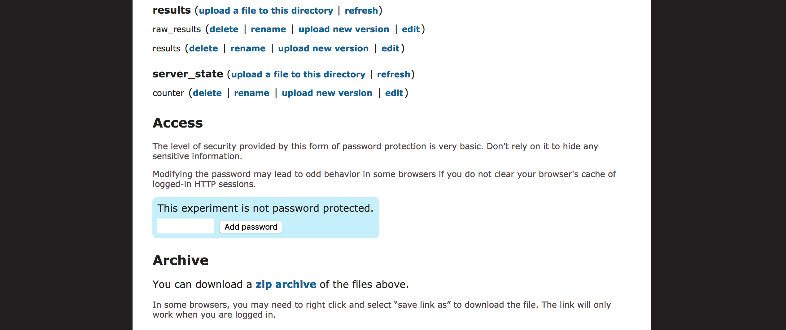

[🔙 Home](https://verbingnouns.github.io/notebooks/)

In this tutorial, we will take the output of an [Ibex Farm](http://spellout.net/ibexfarm/) experiment and process it into a form that we can analyse in [R](https://www.stats.bris.ac.uk/R/). The code in this tutorial is adapted from code by [Laurel E. Brehm](http://www.mpi.nl/people/brehm-laurel-ellen/research). It's a unix `bash` script, which can be run in **Terminal** on a Mac and [**cygwin**](https://www.cygwin.com/). One note about **cygwin**: it seems to create a shell around your C: drive that allows it to index and search for directory paths. This means your home path may look something like this: `cygdrive/c/...`. (It's possible **Console** on Windows is also useful, though [I haven't tested it  yet](https://docs.microsoft.com/en-us/windows/wsl/install-win10)).

# Downloading your data…

At the end of gathering data, you will have several files in the **results** section of your experiment(s). You only need the raw_results files in order to process your data, but it's good to archive and preserve the whole experiment in its end state, so I recommend that you download the entire experiment by clicking on the link for the **zip archive**.

# Prep file(s) for processing…
