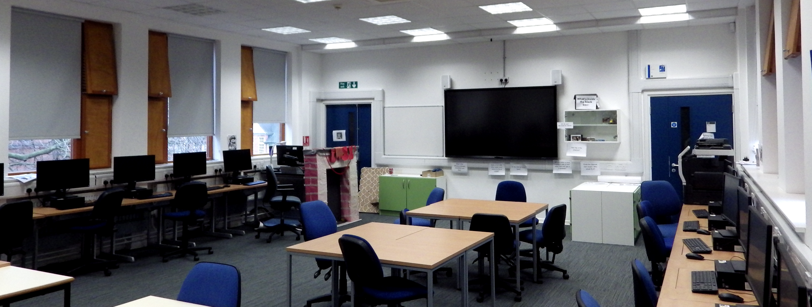
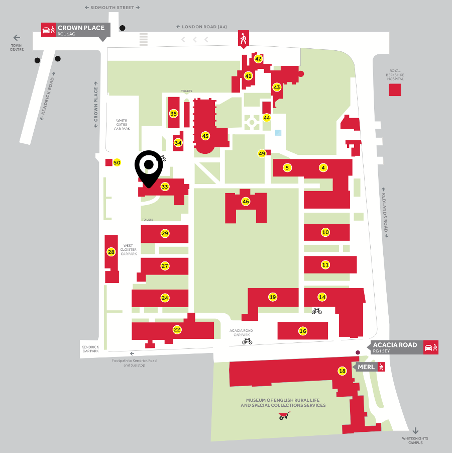

[🔙 Home](https://verbingnouns.github.io/notebooks/) || [Day 1 ⇢](notebooks/20190603-base_R.nb.html)

```{r, include=FALSE}
knitr::opts_chunk$set(echo = TRUE)
```

# Purpose {.tabset}

In this four-day workshop, you will explore [R](https://cran.r-project.org/) and [RStudio](https://www.rstudio.com/products/rstudio/download/#download), which are extremely powerful, flexible tools. However, they are only useful if you know how to get started. This summer school is aimed at postgraduates and staff who are interested in using R but either do not feel comfortable with it or wish to learn it in a classroom context. I will not assume any previous experience with R, but I will assume a basic understanding of statistics (e.g., linear regressions, correlations) and familiarity with concepts in quantitative linguistics and/or psychology.

There will be computers available in the workshop location. If you wish to learn to use R on your own laptop, please make sure you have the latest version of R downloaded (3.6.0) and at least a moderately recent RStudio (1.1.463 or greater). The room we will be meeting in (London Road Campus, L33 120) has a somewhat unusual arrangement, so please make sure to have each day's files downloaded to the computer you are using so that you can follow along without needing to crane your neck!


## Schedule

### Daily schedule 

| Time | Event |
| --- | --- |
| 09h15 - 09h45 | Tea/coffee |
| 09h45 – 10h00 | Set up computers/laptops |
| 10h00 - 13h00 | Workshop (morning session) |
| 13h00- 14h00 | Lunch (incl tea/coffee) |
| 14h00 – 16h00 | Workshop (afternoon session) |

#### Day 1. R and RStudio interfaces, RMarkdown, and best practices

  - Basic functionality
  - Organising files
  - Keyboard shortcuts
  - Writing scripts and notebooks
  - Interfacing with GitHub
    
#### Day 2. Data frame manipulation using `tidyverse`

  - Piping syntax and code replicability
  - `tidyr`, `dplyr`, related packages
  - Cleaning, combining, and rearranging data frames
  
#### Day 3. Data visualisation using `ggplot2` and best practices

  - Structure and syntax of `ggplot()` and `geom`
  - Customising and combining plots
  - Determining what plot is best for your data

#### Day 4. Basic linear models without and with mixed effects

  - Building/selecting an appropriate model, including random effect structures
  - Gaussian, binomial, poisson, and ordinal regressions
  - Maximal vs parsimonious models
  - Practical use of `lm()`, `lmer()`, `glm()`, `glmer()`, `clmm()`
  - Dummy coding vs contrast coding
  - Interpreting and reporting the output

## Location

### Workshop location



London Road L33 120



*An official map of campus can be found [here](http://www.reading.ac.uk/web/files/maps/london-road-campus-map.pdf).*

# Contact

You can contact me via email at [lauren.ackerman@ncl.ac.uk](mailto:lauren.ackerman@ncl.ac.uk).


---
