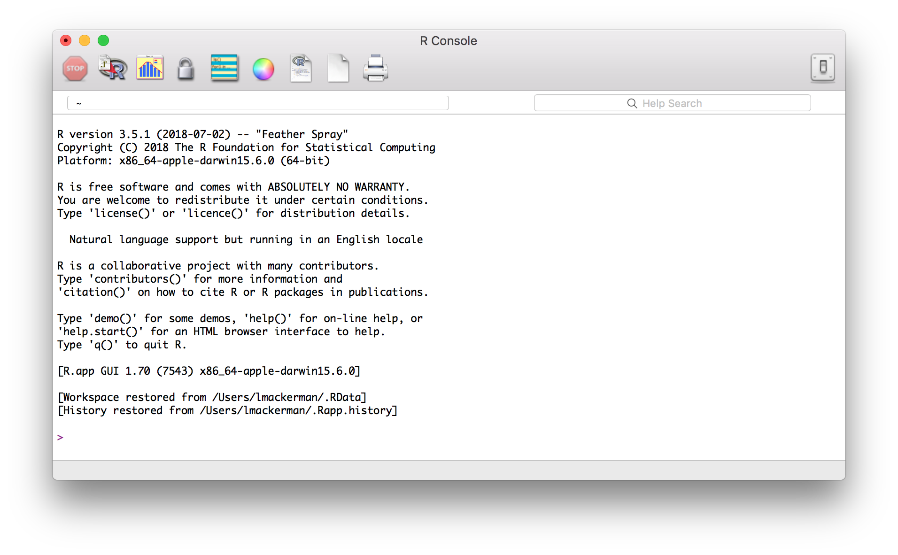
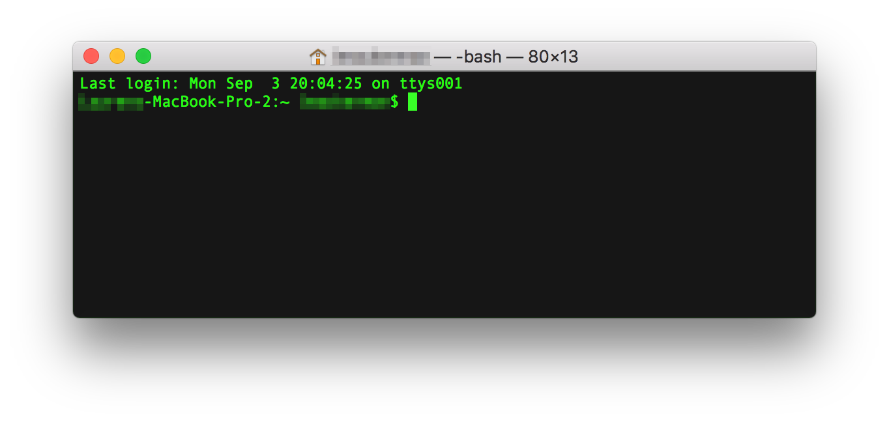
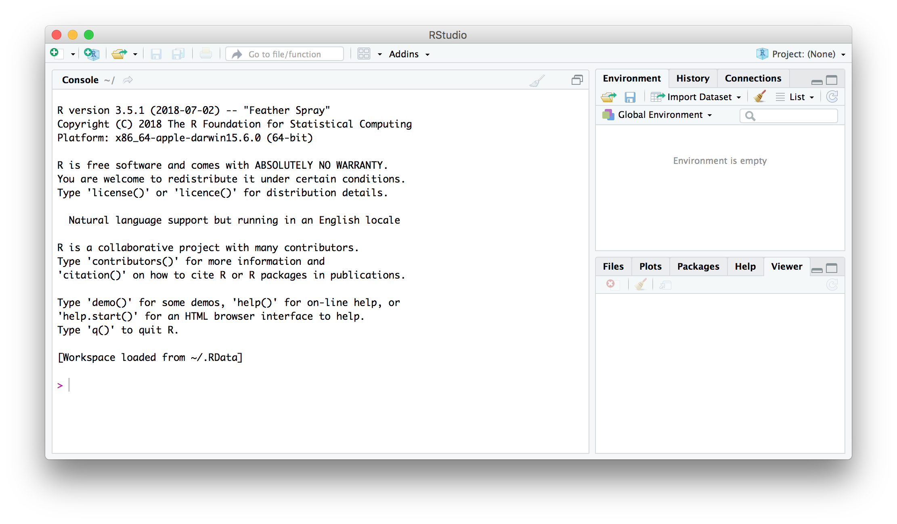
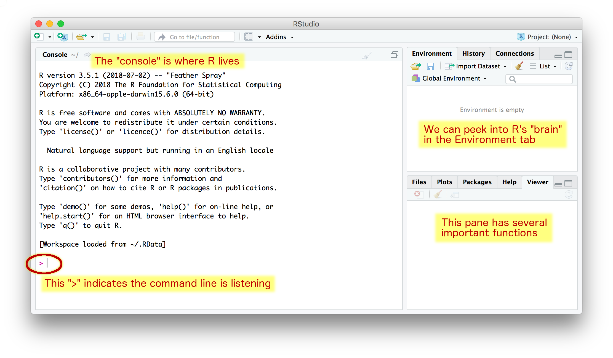
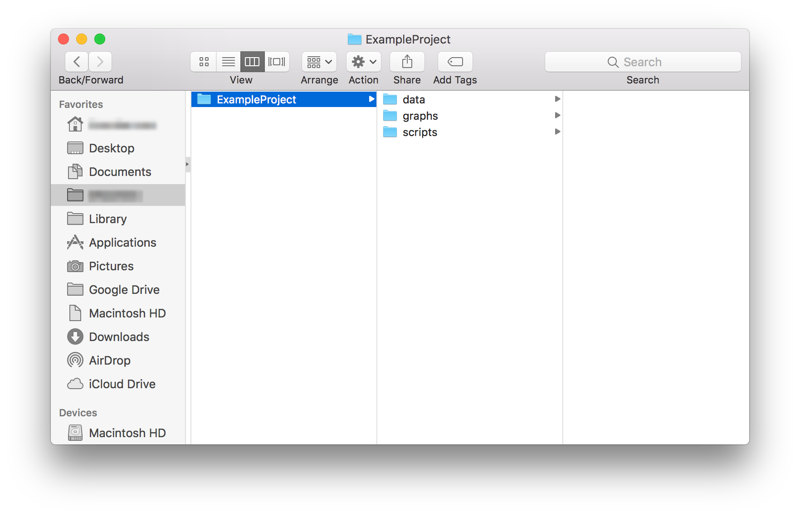
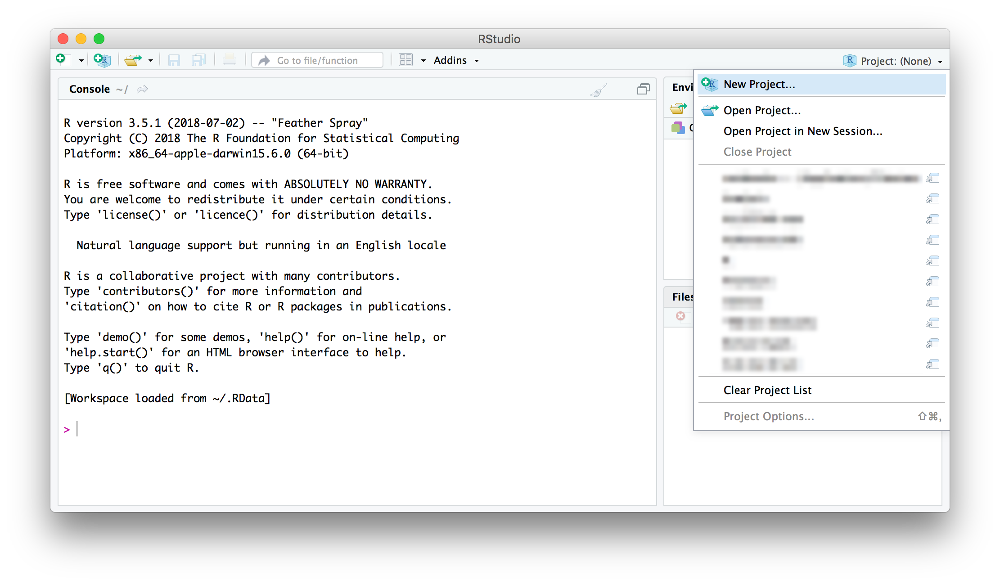
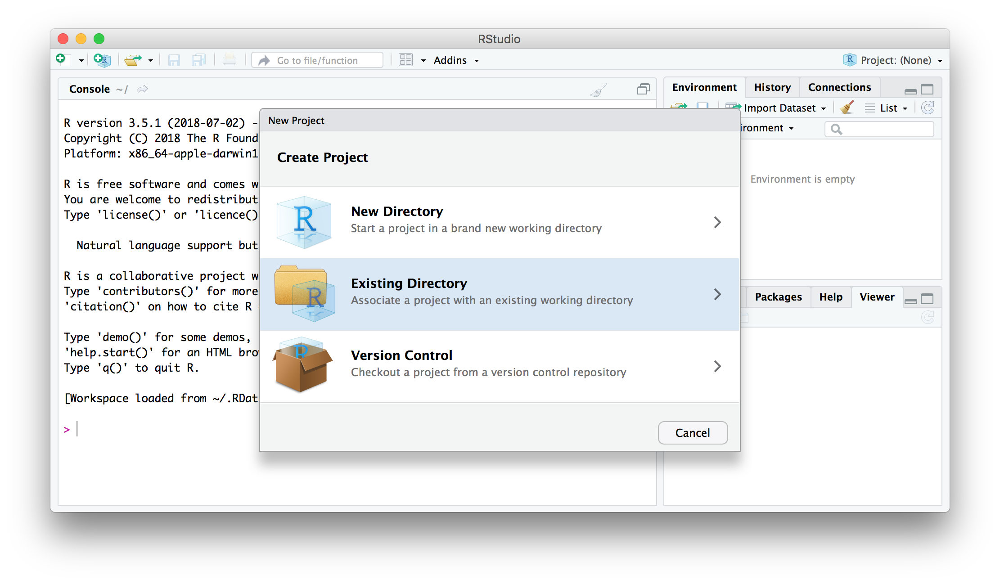
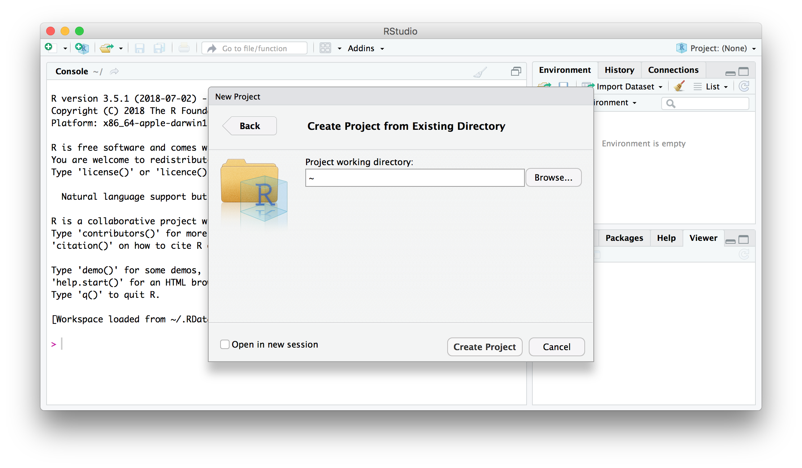
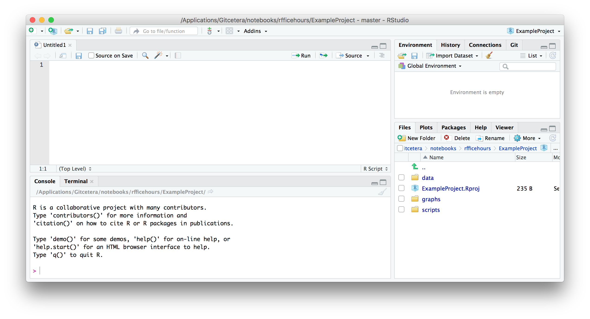

```{r setup, include=FALSE}
knitr::opts_chunk$set(echo = TRUE)


# 1. R and RStudio interfaces, RMarkdown, and best practices
#    - Basic functionality, shortcuts, writing scripts and notebooks, organising files, interfacing with GitHub
# 2. Data frame manipulation using Tidyverse
#    - Piping syntax and code replicability
#    - Tidyr, Dplyr, related packages
#    - Cleaning, combining, and rearranging data frames
# 3. Data visualisation using ggplot and best practices
#    - Structure and syntax of ggplot and geom
#    - Customising and combining plots
#    - Determining what plot is best for your data
# 4. Basic linear models without and with mixed effects (including gaussian, binomial, and ordinal)
#    - building/selecting an appropriate model, including random effect structures
#    - maximal vs parsimonious models
#    - practical use of lm(), lmer(), glm(), glmer(), clmm()
#    - dummy coding vs contrast coding
#    - interpreting the output
```

Download course materials from [here](https://github.com/VerbingNouns/...).

bit.ly/-----------

These packages should already be installed on the lab computers. Please make sure you have installed them on your laptop before **tomorrow**, if you are using one.

```{r}
install.packages(tidyverse,ordinal,lme4)
```

# Introduction: R and RStudio 

This workshop is designed to introduce you to practical uses and issues in R and RStudio, aimed at linguists and psychologists (well, psycholinguists). In this first day, we will start with the fundamentals of interacting with the programs.

R is a programming language that we can use to tell the computer what to do. We can "speak" R to the computer a number of ways, e.g., through the command line (Terminal in Macs) or through the R app.

Before you can use R and RStudio, it's important to understand what you're looking at and where to find things.

## R vs RStudio 

### What is the difference between R and RStudio?

**R** is the program and programming language that allows you to input commands and get the computer to do things. In order to interact with R, some people use a simple R interface, some people use the command line, and some people use RStudio.

**RStudio** is a GUI (Graphical User Interface) that allows you to interact with R and keep everything organised.





We'll be using **RStudio** because it is the easiest to use, with some point-and-click commands, but still with the full functionality and power of R. R runs in the background when you run RStudio, but RStudio takes care of that on its own so all you need to do is open RStudio.

### What is going on in the RStudio window?

The RStudio interface has (up to) four panes that you can rearrange and customise to suit your needs. Here is the default configuration:


When you open RStudio for the first time, there may only be three panes.

#### The Console

The console is your direct line of communication with R. It operates a bit like a chat window (if you're familiar with that) because you can type things into the console, hit `ENTER`, and R will do something (and sometimes, depending on what you type, it'll respond). You know the console is listening and ready to accept a new command if you see a `>` on the left edge of the window on the lowest line of text.

#### Environment

The environment is a set of three tabs that effectively lets us see into "R's brain" (thanks Danielle!). This window lets you see what variables you've created, what datasets are loaded in, what packages and libraries are loaded, among many other things. Right now, it's empty.

If we click on `Global Environment`, we can see what packages have automatically be loaded into this R session. Once you load other packages in, you will see them here too.

```{r, echo=FALSE}
htmltools::img(src = knitr::image_uri("../gui/global_environment.png"), 
               alt = 'logo', 
               style = 'position:relative; top:0; right:0; padding:10px; width:70%')
```

#### Files etc

The pane in the lower right has five tabs by default.

1. **Files**  
    - This tab will show you what files are in the folders you navigate to.  
    - This is useful if you want to preview a dataset, open a script, or figure out where you saved something.  
2. **Plots**  
    - This tab will display plots you generate from the console.  
    - You can click `Zoom` to pop the graph out into a separate window and resize it.  
    - You can click `Export` to save the plot as a PNG, PDF, EPS, etc.  
3. **Packages**  
    - In this tab, you can see what packages have been downloaded and loaded.
4. **Help**  
    - This tab will let you look through the documentation and get tips on how to use different functions.
5. **Viewer**  
    - I've never used this.  

## Best practices 

How do you keep all your related files organised?

Keeping your files organised will make your life infinitely easier and will help you ease back into using R if you come back to it after a hiatus. The RStudio interface will help with this, but there is no better foundation than good file management.

### Your project folder

[Danielle Turton](https://www.staff.ncl.ac.uk/danielle.turton/) and I suggest the following as a best practice:

1. Create a folder with the name of your project.  
    - If possible, do not use SPACES or SPECIAL CHARACTERS. These can cause issues across platforms.  
    - If you want to separate words, use UNDERSCORES (_), HYPHENS (-), or CamelCase.  
2. Within your project folder, create three subfolders.  
    - **data**: This is the place you'll store all your datasets and spreadsheets.  
    - **graphs**: This is the place you'll save the outputs of your script.  
    - **scripts**: This is the place you'll save your R scripts and notebooks.  
3. Name all scripts, graphs, and datasets using the following templates:  
    - YYYYMMDD-descriptive_name.R  
    - YYYYMMDD-name_of_generating_script_or_dataset.PNG  
    - YYYYMMDD-dataset_name_or_source.csv (or .txt)  



### Creating an .RProj

RStudio offers a neat feature called a *project* (file type `.Rproj`). A project keeps all your scripts and datasets handy and can save variables for use later, even if you quit and restart RStudio. This can be useful if you are running complex models, for instance.

To create a new project, click on the small triangle in the upper right corner of the RStudio window.



This will bring up a menu with a number of useful options, but right now, we want to create a *New Project...*



Since we have already created a folder (i.e., a directory) for our project, we can click on the *Existing Directory* option. If you haven't created a folder for your project, you can create a new directory, but in this case you should still follow best practices for file organisation.



From this window, we can browse our computers for the location of the folder we've set up.

### Troubleshooting

I have noticed that sometimes students whose computers are set up with a non-English language, particularly with a non-Latin alphabet, can run into problems with setting up these folders. It is important to instruct them to use only Latin characters for the folders that R and RStudio will access, as non-Latin characters use a type of encoding that not all programs can read.

# Base R functionality 

## Scripts

Scripts will appear in the fourth pane (top left by default). 



Scripts are simply text files, they are not R and they don't do anything unless you perform specific actions on them. They're a bit like instruction manuals, but R can only read them if you manually send the instructions to the console (more on this later).

### What is the point of a script?

**A script is a way to save your work so you only need to write the code once.** Once you've written a script once, you can execute it as many times as you like, but you won't need to *write* it again. You can copy and paste other people's code into your script and tweak it to fit your needs. You can debug your code without having to type it in new each time. You can share your code with others, and you can leave comments to yourself in your code so that you can leave it sit for a while and then remember what you were doing when you come back to it.

### How do you write a new script?

On all platforms: the green + symbol in the top left corner will let you create a new script.

On a Mac: `command`+`shift`+`N`  
On a PC:  

The symbol `#` hides the text that follows on that line from R, that is, it "comments it out". This lets you write comments to yourself and to anyone else who might read your code. You'll want to do this so you can remember what you were doing (*trust* me, you will not remember) and so other people can replicate what you did (even if it's just to help you debug your code later).

If you type `print("Hello World!")` (with a nice comment) and then hit `ENTER` in your console, you will see something like this:

```
> print("Hello World!") # this line will produce the text between the quotes
```
`[1] "Hello World!"`

If you type `print("Hello World!")` and hit `ENTER` in a script, you will see something like this:

```
print("Hello World!")  
 
```

(Note that nothing happens. There is no output. A script is just a text file.)

### How do you use a script? 

Open a new script and type `print("Hello World!")` into it. How do you get R to execute your code? There are a couple ways:  

- Click the `Run` button on the top right portion of the script pane.
    - This will run everything in your script.
- Use a keyboard shortcut
    - To run only the line your cursor is on, `Command`+`Enter`
    - To run only the selected code, select some code and use `Command`+`Enter`
    - To run the entire script, `Command`+`Shift`+`Enter`

When you run a script, the text in the script is sent, line by line, to the console. Once in the console, R executes the code. You can watch the code progress in the console. If there is any text or numerical output, it will appear in the console. If there is a graphical output, it will appear in the Plots tab of the lower right pane (Files etc).

### Saving in RStudio

Now that we've gone through the fundamentals of organisation and basic R operators, we can get into the more important task of reading data and writing output (i.e., saving our work).

Once you've created a project (.Rproj), you can open the project and it should open right to where you left off. This means your scripts will open as well, as long as you did not close them the last time you worked on the project. However, if you want to open a script that isn't currrently open but does exist, you can do so in the Files tab of the lower right pane. Click on the name of the script, and it will open in a new tab of your scripts pane (top left by default).


## R is a calculator

Its least unique function is to compute arithmetic. You probably don't want to use R just to add sums, but you could do.
```{r}
3 + 4
```

White space doesn't matter for most things (so you can put spaces between numbers, operations, names).
```{r}
3+4
```

Order of operations follows standard rules (BIDMAS / BODMAS / PEMDAS):
```{r}
3*4^2
```
```{r}
(3*4)^2
```


### **Try it for yourself**

1. Create a new script.
2. Save and name the script appropriately. (YYYYMMDD-descriptive_name.R)
3. In the script, enter the following code:  
```
print("Hello world!")
3 + 4
7^2
```
4. Run the entire script.

Your console should end up looking like this:  
```
> print("Hello world!")
[1] "Hello world!"
> 3 + 4
[1] 7
> 7^2
[1] 49
>
```

(In the rest of this document, instead of output starting with `>`, it may start with `##`. This is due to how R compiles a script to an HTML document and does not change anything in the script, code, or contentful output.)

#### What does `[1]` mean?

The number in square brackets to the left of the output indicates the number of values that have been printed by index number. That is, if there are multiple outputs on one line, [1] will appear. If the seventh item in the output wraps around and appears on the second line, both [1] and [7] will appear. This is useful when trying to make sense of long lists of numbers, for instance.

Below, I saved two longer strings of text into one variable called `longText`. Then when it's printed, it appears on two lines. The `[1]` indicates the first item in the list is the first item on the line and the `[2]` indicates the second item in the list is the first item that appears on that line.

```{r longtext}
longText <- c("i don't think we'll be able to fit this text on one line of the output console","so that it might wrap around and display on two lines")
print(longText)  
```

### What is a variable?

One of the most important components of (almost) any programming language is a *variable*. A variable is an object that can be assigned a value, a list of values, a matrix of values, or something along those lines. A variable in R can be named almost anything with a few exceptions:

A variable name…  

- Cannot start with a number  
- Cannot contain white space (i.e., spaces, tabs, line breaks)  
- Can contain `.` or `_` but cannot contain other non-alphanumeric characters  
- Should begin with a lowercase letter  
- Should be memorable and descriptive  
- Should not be too long or difficult to type  
- Should not be too vague or general  

To assign a value (etc) to a variable, there are three possible operators: `=`, `<-`, or occasionally `->` (the latter two look like arrows).

First we assign the value of 3 to the variable `x`. Notice that spaces between the numbers and the operator are optional. I like to use them to help see each component more clearly.

```{r}
x = 3 # or x=3
x
```

We can also use one of the arrow operators. The two characters that comprise the arrow cannot have space between them. They act as a single unit. For the leftward-facing arrow, the value(s) on the right are assigned to the variable on the left.

```{r}
y <- 4 # or y<-4
y
```

Now that we've assigned values to `x` and `y`, we can do things to them. Below, I demonstrate some basic arthimetic operators that allow R to act like a calculator.

```{r}
x + y
x * y
x / y
x ^ y
```

Finally, the rightward-pointing arrow is used very rarely, but functions in a similar way to the other two assignment operators. The value(s) on the left are assigned to the variable on the right.

```{r}
x + y -> z # or z <- x + y or z=x+y
z
```

To assign more than one value to a variable, there are several functions we can use, but the most common and easiest is `c()`. To read more about the function `c()`, you can type `c` into the search bar in the help tab in the lower right pane, *or* you can input the following into your console:
```{r}
?c
```

In short, this function *combines* a series of values into a vector or list.

```{r, message=TRUE, error=TRUE}
c(1,2,3)
c("1","2","3")
c("one","two","three")
c(one,two,three)
```

Note that bare numbers are green and are output without quotation marks, numbers and words in quotation marks are output as such, but *words without quotation marks produce an error*. This is because R assumes that all words without quotation marks are variables, but we haven't created variables named `one`, `two`, or `three`.

```{r}
one = 1
two = 2
three = 3
c(one,two,three)
```


## R is for interacting with data files

> Dataset `sleep`:

```{r}
head(sleep)
```

* column 1 = how many extra hours of sleep were recorded
* column 2 = which drug was administered
* column 3 = which participant

# Indicies 
## Finding the index of the value you want

What does this do?
```{r}
sleep[1,]
```

How does this differ from `[1,]`?
```{r}
sleep[2,] # so that means this is row 2
```

How does this differ from `[3,]`?
```{r}
sleep[,3] # what do you think this is?
```

…which makes it `dataset[row,column]`

## Navigating biggeratasets

In your script (or, if you don't take my advice, in your console), you can open and manipulate a dataset.

Right click and save [this file](https://raw.githubusercontent.com/VerbingNouns/notebooks/master/data/binomial-data.csv) to your folder named `data`.

```{r, echo=FALSE}
data <- read.csv("../data/binomial-data.csv")
```

```{r, error=TRUE, eval=FALSE}
data <- read.csv("data/binomial-data.csv")
```

Now, if you want to view the first six rows of the dataset to see what types of things are in it, you can use the function `head()`.

```{r, asis=TRUE}
head(data)
```

You can also look at the bottom six rows with `tail()`

```{r}
tail(data)
```

### Basic querying functions

If we want to find out what each of the experiments are called, or how many conditions there are, we can use the function `unique()`. 

Note that we must specify what variable name we've given our dataset (`data`) and what column we want to query (`experiment`). The relationship between the dataset and the column in the dataset is specified with the `$` operator.

```{r}
unique(data$experiment)
```

There are three experiments, and their names are `"first"`, `"second"`, and `"third"`. 

If we want to know *how many* unique values there are in a column, we can embed the `unique()` function in the `length()` function.

```{r}
length(unique(data$experiment))
```

There are three different experiments in this dataset.

### Cells within a dataset

Finally, if we want to find out how many unique items there are in experiment "first" only, we can specify a subset of the dataset using square brackets `[]`. Before we do that, though, let's go through what the arguments for the square brackets are.

An **index** refers to the location of an item in a list, vector, or matrix.

If you have a list that looks like the one below, *green* is at index `4` (in the R programming language).

`["red", "orange", "yellow", "green", "blue", "indigo", "violet"]`

If you have a matrix like the one below, you must specify the index of the row and/or column (`[row,column]`).

| colour | wordLength | waveLengthNM |
|--------|------------|------------|
| red    | 3          | 700        |
| orange | 6          | 630        |
| yellow | 6          | 600        |
| green  | 5          | 550        |
| blue   | 4          | 470        |
| indigo | 6          | 425        |
| violet | 6          | 400        |

The location of *green* is in the fourth row and the first column, so we can identify it as `[4,1]`. If we only specify the row (`[4,]`), we will get everything in the fourth row (`"green", 4, 470`). If we only specify the first column, we will get a list of colours, like we did above: 

(`"red", "orange", "yellow", "green", "blue", "indigo", "violet"`)

Now, going back to our dataset, if we want to view the content of one column, such as `experiment`, we can specify that column with the `$` operator. But if you want to view a subset of a column, we can also specify what criteria we want to view (or don't want to view).

For instance, if we want to view only the second experiment (which is called `second` in the `experiment` column, helpfully enough), we can use the code below:

```{r}
data[data$experiment=="second",]
```


## More descriptive methods

You can also navigate with column names:
```{r}
sleep$ID
```

How would you view the column `extra`?
```{r}
sleep$extra
```

Use `str()` to get a summary of the structure of the dataset
```{r}
str(sleep)
```

What are all the unique values in `ID`?
```{r}
unique(sleep$extra)
```

What's the value in the first row, third column?
```{r}
sleep[1,3]
```

What's the first element in the column `ID`?
```{r}
sleep[1,]$ID
sleep$ID[1]
```

You can also view the dataset as a spreadsheet (although it can't be altered).
```{r}
View(sleep)
```

