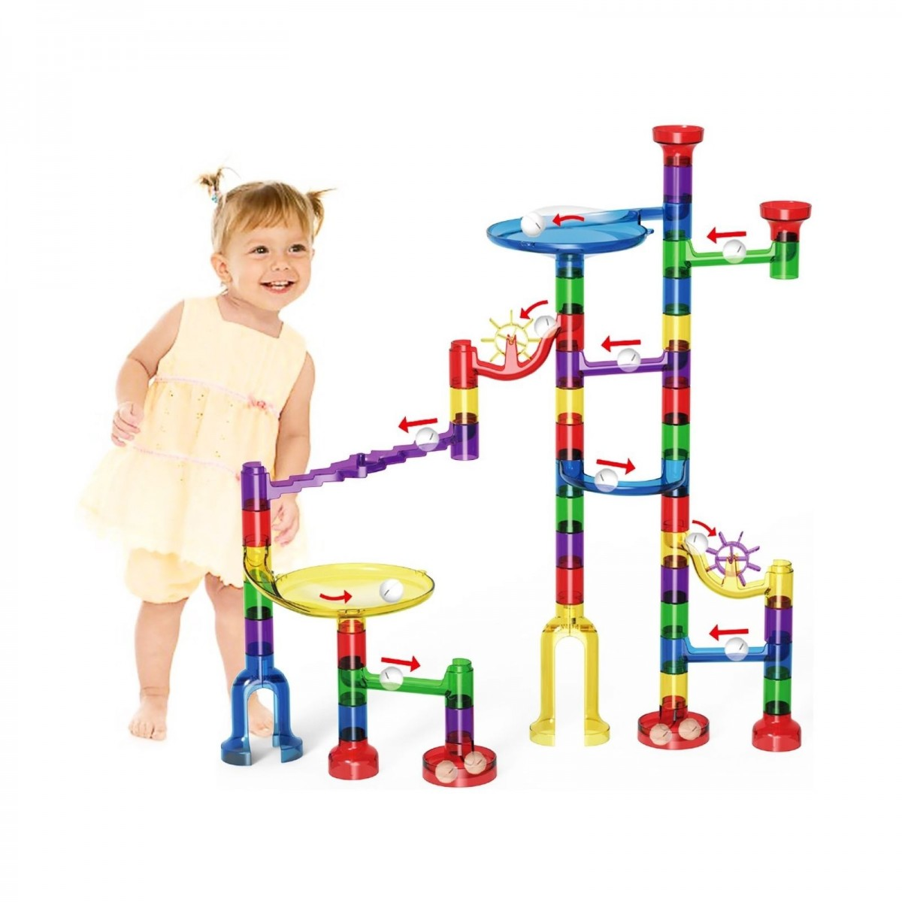

```{r setup, include=FALSE}
knitr::opts_chunk$set(echo = TRUE)


# 1. R and RStudio interfaces, RMarkdown, and best practices
#    - Basic functionality, shortcuts, writing scripts and notebooks, organising files, interfacing with GitHub
# 2. Data frame manipulation using Tidyverse
#    - Piping syntax and code replicability
#    - Tidyr, Dplyr, related packages
#    - Cleaning, combining, and rearranging data frames
# 3. Data visualisation using ggplot and best practices
#    - Structure and syntax of ggplot and geom
#    - Customising and combining plots
#    - Determining what plot is best for your data
# 4. Basic linear models without and with mixed effects (including gaussian, binomial, and ordinal)
#    - building/selecting an appropriate model, including random effect structures
#    - maximal vs parsimonious models
#    - practical use of lm(), lmer(), glm(), glmer(), clmm()
#    - dummy coding vs contrast coding
#    - interpreting the output
```

Download course materials from [here](https://github.com/VerbingNouns/...).

 bit.ly/-----------
 
 ## Tidyverse functionality {.tabset}

```{r}
library(tidyverse)
```

A `tibble` is different from a `table`.
```{r}
as.tibble(sleep)
```

> Pipes are like toy funnels

%>%




```{r}
sleep %>%
  head()

# or

sleep %>%
  head
```

How many attestations of each type of `group`?
```{r}
sleep %>%
  count(group)
```

How can you make a new column? Duplicate `group` into `group2`:
```{r}
sleep %>%
  mutate(group2 = group)
```

Let's rename the levels in `group` to be "one" and "two":
```{r}
sleep %>%
  mutate(group2 = case_when(group==1 ~ "one",
                            TRUE ~ "two"))
```


What's wrong with this one?
```{r}
sleep %>%
  mutate(group2 = case_when(group==1 ~ as.factor("one"),
                            group==2 ~ as.factor("two")))
```


```{r}
sleep %>%
  mutate(group2 = case_when(group==1 ~"one",
                            group==2 ~"two")) %>%
  mutate(group2 = as.factor(group2))
```


Now, let's recreate the `count` function with `group_by` and `summarise`:
```{r}
sleep %>%
  group_by(group) %>%
  summarise(n = n())
```


We cal use `group_by` and `summarise` to do a lot more than just count:
```{r}
# mean value of `extra` by `group2`
sleep %>%
  mutate(group2 = case_when(group==1 ~"one",
                            group==2 ~"two")) %>%
  mutate(group2 = as.factor(group2)) %>%
  group_by(group) %>%
  summarise(effectMean = mean(extra))
```


## Processing into tables

> Dataset `quakes`:

What does `quakes` look like?
```{r}
quakes %>%
  str

View(quakes)
```

How many observations are there per "level" of magnitude?
```{r}
quakes %>%
  group_by(mag) %>%
  summarise(numberOfObvs = n())
```

Let's create a table of the means, standard deviations, and standard errors for both stations reporting and depths:
```{r}
quakes %>%
  group_by(mag) %>%
  summarise(n = n(),
            stationMean = mean(stations),
            stationSD = sd(stations),
            stationSE = sd(stations)/sqrt(n),
            depthMean = mean(depth),
            depthSD = sd(depth),
            depthSE = sd(depth)/sqrt(n))
```

This dataset is wide. Let's make it long using `gather` (compare to `spread`):
```{r}
quakes %>%
  group_by(mag) %>%
  summarise(n = n(),
            stationMean = mean(stations),
            stationSD = sd(stations),
            stationSE = sd(stations)/sqrt(n),
            depthMean = mean(depth),
            depthSD = sd(depth),
            depthSE = sd(depth)/sqrt(n)) %>%
  gather(measurement, values, 3:8) #-> quakesLong
```

