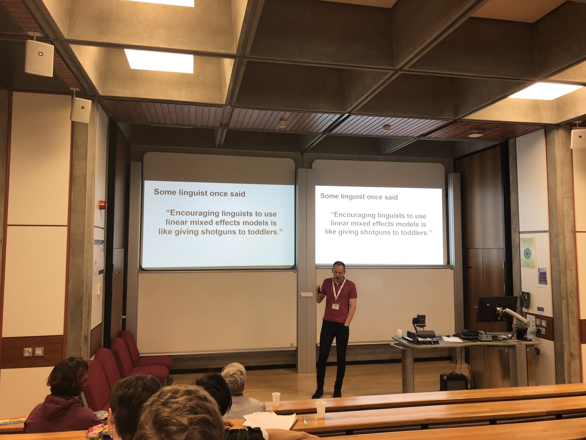

```{r setup, include=FALSE}
knitr::opts_chunk$set(echo = TRUE)


# 1. R and RStudio interfaces, RMarkdown, and best practices
#    - Basic functionality, shortcuts, writing scripts and notebooks, organising files, interfacing with GitHub
# 2. Data frame manipulation using Tidyverse
#    - Piping syntax and code replicability
#    - Tidyr, Dplyr, related packages
#    - Cleaning, combining, and rearranging data frames
# 3. Data visualisation using ggplot and best practices
#    - Structure and syntax of ggplot and geom
#    - Customising and combining plots
#    - Determining what plot is best for your data
# 4. Basic linear models without and with mixed effects (including gaussian, binomial, and ordinal)
#    - building/selecting an appropriate model, including random effect structures
#    - maximal vs parsimonious models
#    - practical use of lm(), lmer(), glm(), glmer(), clmm()
#    - dummy coding vs contrast coding
#    - interpreting the output
```
[⇠ Day 3](20190605-dataviz.html)

Download course materials (.zip file) from [here](http://bit.ly/20190606-updates) *after 5th June*.

[**bit.ly/20190606-updates**](http://bit.ly/20190606-updates)

```{r}
library(lme4)
library(tidyverse)
library(broom)
```

# Storytelling with data

The point of conducting statistical analysis is to find support (or lack of support) for the story you are trying to tell. Statistics without a story (or alternate story) isn't useful.


<small>Bodo Winter telling it like it is. (Photo credit: Adam Schembri 27/02/2019)</small>

The [**Simulated Data**](simulated-data.html) notebook creates realistic-looking fake data that could tell a story about reading times. Let's take a look at the data so we can understand what the possible stories (=hypotheses) are.

Read in the simulated dataset as `data`…
```{r}
data <- read.csv("../data/simulated-data.csv", as.is = TRUE)
```

…and take a look at its structure again.
```{r}
data %>% head
```

## The Ten Statistical Commandments

**NB**: statistical analysis is not the be-all end-all of science! Statistics is a branch of mathematics and is *highly* susceptible to falsification, similarly to many other braches of science. We must treat it with respect, as we are (presumably) not statisticians. We're using their discipline as a tool to understand our own. That doesn't mean we can't do it justice (I hope we can!), but it means we should tread lightly and be kind to one another.


## Linear models

Check out Lisa DeBruine and Dale Barr's resources [here](https://psyarxiv.com/xp5cy).

Components of a linear regression:

$$y=\beta_0 + \beta_1 x_i + \varepsilon$$

* intercept
* slope
* error

Practical components of a linear regression analysis:

$$DV \sim IV1 + IV2 + IV1:IV2 + (1+R_{slope} | R_{intercept}) $$

* dependent variable (DV)
* independent variables (IVs)
* random effects (slopes, intercepts)
* main effects (+)
* interaction effects (:)
    - combination of main and interaction effects (*)

## Why code conditions?

First, let's make a toy dataset:
```{r}
pitch = c(233,204,242,130,112,142)
gender = c(rep("woman",3),rep("man",3))
fake_data = tibble(gender,pitch)
```

We'll talk more about the practicalities of this code shortly, but for now, let's look at a linear regression:
```{r}
fake_data %>% 
  lm(pitch ~ gender, data=.) %>% 
  summary

#lm(pitch ~ gender, data=fake_data)
```

For comparison, let's comare the values in the regression to the aggregate means:
```{r}
fake_data %>% 
  group_by(gender) %>% 
  summarise(meanPitch = mean(pitch))

fake_data$pitch %>% mean
```

In order to (somewhat) easily extract and use the values in the regression, we can save it as a tidy table
```{r}
fake_data %>% 
  lm(pitch ~ gender, data=.) %>% 
  summary %>% 
  tidy -> fake_data_tidy
```

Using the tidy table, we can plot the data points, connect the mean values of the two groups, and identify the overall mean.
```{r}
fake_data %>%
  ggplot(aes(x=gender,y=pitch)) + 
  geom_point(size=3) +
  annotate("segment", # draw the regression line
           x=1, # first categorical group is plotted at 1
           xend=2, # second categorical group is plotted at 2
           y=fake_data_tidy$estimate[1], 
           yend=fake_data_tidy$estimate[1] + fake_data_tidy$estimate[2], 
           colour="red") +
  annotate("point", # draw points for the means for each group (gender)
           x=c(1,2), 
           y=c(fake_data_tidy$estimate[1],
               fake_data_tidy$estimate[1] + fake_data_tidy$estimate[2]), 
           size=9, 
           colour="red", 
           pch="—") +
  annotate("point", # draw the mean for the entire dataset
           x=1.5, # halfway between 1 and 2
           y=pitch %>% mean, 
           size=9, 
           colour="blue",pch="+") +
  annotate("text", # label men's mean
           x=.85,
           y=fake_data_tidy$estimate[1],
           label=fake_data_tidy$estimate[1] %>% round(2)) +
  annotate("text", # label overall mean
           x=1.35,
           y=pitch %>% mean,
           label=pitch %>% mean %>% round(2)) +
  annotate("text", # label women's mean
           x=1.85,
           y=fake_data_tidy$estimate[1] + fake_data_tidy$estimate[2],
           label=fake_data_tidy$estimate[1] + fake_data_tidy$estimate[2] %>% round(2)) +
  geom_vline(xintercept=1.5, lty="dotted")
```

Ideally, the dotted line would be the intercept and each group would be identified as being either greater or less than the overall mean. However, with categorical data, R selects the alphabetically earliest group as the baseline. This means the overall mean (calculated below) doesn't appear in our output or results.
```{r}
fake_data %>% 
  summarise(meanPitch = mean(pitch))
```

In order to force R to use a more sensible baseline, we can *code* the data.

### Dummy coding

Dummy coding selects one level as the baseline, which doesn't have to be alphabetically first.

```{r}
fake_data %>% 
  mutate(gender.dummy = case_when(gender == "woman" ~ 0,
                                  gender == "man" ~ 1)) %>% 
  lm(pitch ~ gender.dummy, data=.) %>% 
  summary
```

### Contrast coding

Contrast coding forces the intercept to be centered in between the two groups (where the overall mean would be).

If we center our conditions around 0 with 1 unit (arbitrary unit) between them, their values should be +0.5 and -0.5. This makes the estimate the difference between the two group means.
```{r}
fake_data %>% 
  mutate(gender.contrast = case_when(gender == "woman" ~ 0.5,
                                     gender == "man" ~ -0.5)) %>% 
  lm(pitch ~ gender.contrast, data=.) %>% 
  summary()
```

If we instead use the values +1 and -1, the estimate is difference between each group's mean and the overall mean.
```{r}
fake_data %>% 
  mutate(gender.contrast = case_when(gender == "woman" ~ 1,
                                     gender == "man" ~ -1)) %>% 
  lm(pitch ~ gender.contrast, data=.) %>% 
  summary()
```

If we have three groups, this gets a little trickier, but we can still easily code and analyse our data with non-arbitrary intercepts and estimates. If we have time, we can talk about this at the end.

# Continuous data

## Visualise

What can we do to get a sense of the data?
```{r}
data %>% 
  ggplot(aes(x=age, y=rt)) +
  geom_point(alpha=.15) +
  geom_smooth(method="lm")
```

```{r}
data %>% 
  lm(rt ~ scale(age, scale=FALSE), data=.) %>% 
  summary()

data %>% 
  lm(rt ~ age %>% scale(scale=FALSE), data=.) %>% 
  summary()
```

```{r}
data %>% 
  mutate(wordLength = nchar(word),
         residRT = rt/wordLength) %>% 
  ggplot(aes(x=region %>% as.factor(), y=residRT)) +
  geom_boxplot()
```

```{r}
data %>% 
  mutate(wordLength = nchar(word),
         residRT = rt/wordLength) %>% 
  ggplot(aes(x= gram, y=residRT, fill=freq)) +
  geom_boxplot() +
  facet_wrap(~region)
```


## Analyse

Build a simple linear model to examine region 3 (the verb):
```{r}
# summary(
#     lm ( DV ~ IV1 * IV2 + IV3 , data = data )
#        )
data %>%
  filter(region==3) %>% 
  mutate(wordLength = nchar(word),
         residRT = rt/wordLength) %>% 
  mutate(gram.coded = case_when(gram=="yes" ~ 0.5,
                                gram=="no" ~ -0.5),
         freq.coded = case_when(freq=="high" ~ 0.5,
                                freq=="low" ~ -0.5)) %>% 
  #lm(residRT ~ gram*freq + age + gram:freq:age, data=.) %>% 
  lm(residRT ~ 
       gram.coded + 
       freq.coded + 
       gram.coded:freq.coded, 
     data=.) %>% 
  summary()
```

Add in mixed effects for a linear mixed effects model:
```{r}
#summary(
#  lmer( DV ~ IV1 * IV2 + IV3 + ( 1 | RV1 ) + ( 1 | RV2 ) , data = data)
#        )
data %>%
  filter(region==3) %>% 
  mutate(wordLength = nchar(word),
         residRT = rt/wordLength) %>% 
  mutate(gram.coded = case_when(gram=="yes" ~ 0.5,
                                gram=="no" ~ -0.5),
         freq.coded = case_when(freq=="high" ~ 0.5,
                                freq=="low" ~ -0.5)) %>% 
  lmer(residRT ~ 
       gram.coded + 
       freq.coded + 
       gram.coded:freq.coded +
       (1 | subj) +
       (1 + gram.coded || item), 
     data=.) %>% 
  summary()
```

```{r}
# assign the manipulated data to data.reg3
data %>%
  filter(region==3) %>% 
  mutate(wordLength = nchar(word),
         residRT = rt/wordLength) %>% 
  mutate(gram.coded = case_when(gram=="yes" ~ 0.5,
                                gram=="no" ~ -0.5),
         freq.coded = case_when(freq=="high" ~ 0.5,
                                freq=="low" ~ -0.5)) -> data_reg3
```


We should do model comparison to assess the contribution of each of the factors to the overall fit. But, read the Bates et al and Barr et al papers for an overview of the debates around how to design and test models.

Let's do model comparison for region 3:
```{r}

mdl1.max <- lmer(residRT ~ 
                   gram.coded + 
                   freq.coded + 
                   gram.coded:freq.coded +
                   (1 | subj) +
                   (1 + gram.coded || item), 
                 data=data_reg3)
mdl1.int <- lmer(residRT ~ 
                   gram.coded + 
                   freq.coded + 
                   #gram.coded:freq.coded +
                   (1 | subj) +
                   (1 + gram.coded || item), 
                 data=data_reg3)
mdl1.frq <- lmer(residRT ~ 
                   gram.coded + 
                   #freq.coded + 
                   #gram.coded:freq.coded +
                   (1 | subj) +
                   (1 + gram.coded || item), 
                 data=data_reg3)
mdl1.grm <- lmer(residRT ~ 
                   #gram.coded + 
                   freq.coded + 
                   #gram.coded:freq.coded +
                   (1 | subj) +
                   (1 + gram.coded || item), 
                 data=data_reg3, REML=FALSE)

anova(mdl1.max,mdl1.int) # max vs int
anova(mdl1.int,mdl1.frq) # int vs frq
anova(mdl1.int,mdl1.grm) # int vs grm

```

How do regions 4 and 5 compare?:
```{r}

```

# Ordinal data 

## Visualise

What ways would you visually explore rating data?
```{r}
data %>% head
unique(data$rating)

data %>% 
  filter(region==1) %>% 
  group_by(rating %>% as.factor) %>% 
  summarise(n = n())

data %>% 
  filter(region==1) %>% 
  group_by(gram,freq) %>% 
  summarise(meanRating = mean(rating))
```

## Analyse

First, how could we go about using `lmer` for rating data?
```{r}

```

### Better ordinal data

```{r}
library(ordinal)
```

For the ratings, build models like above, but using `clmm()` (these take a little longer to run):
```{r}
clmm(rating %>% as.factor ~ 
       gram.coded +
       freq.coded +
       gram.coded : freq.coded +
       (1 | subj) +
       (1 | item),
     data = data_reg3) %>% 
  summary
```


```{r}
mdl2.max <- clmm(rating %>% as.factor ~ 
       gram.coded +
       freq.coded +
       gram.coded : freq.coded +
       (1 | subj) +
       (1 | item),
     data = data_reg3)
mdl2.int <- clmm(rating %>% as.factor ~ 
       gram.coded +
       freq.coded +
       # gram.coded : freq.coded +
       (1 | subj) +
       (1 | item),
     data = data_reg3)
mdl2.grm <- clmm(rating %>% as.factor ~ 
       #gram.coded +
       freq.coded +
       #gram.coded : freq.coded +
       (1 | subj) +
       (1 | item),
     data = data_reg3)
mdl2.frq <- clmm(rating %>% as.factor ~ 
       gram.coded +
       #freq.coded +
       #gram.coded : freq.coded +
       (1 | subj) +
       (1 | item),
     data = data_reg3)

anova(mdl2.max,mdl2.int)
anova(mdl2.int,mdl2.grm)
anova(mdl2.int,mdl2.frq)
```

```{r}
install.packages("afex")
library(afex)

# mixed( lmer(your maximal model here) )
```


### Visualise plogis

> See [**visualising_ordinal_data.R**](visualising_ordinal_data.R) for Predicted Curves script

```{r}
# Script written by Lauren M Ackerman
# 26 February 2019
# Contact: l.m.ackerman AT gmail DOT com
# Adapted from Jalal Al-Tamimi

clmm.max <- clmm(as.factor(rating) ~ 
                   interaction(freq,gram) + 
                   (1 | subj) + 
                   (1 | item),
                 data = data[data$region == 1,]) # ordinal regression with INTERACTION BUILT INTO MAIN EFFECT

vlines <- c(0, # intercept, interaction(freq, gram)high.no
            clmm.max$beta[[1]], # interaction(freq, gram)low.no
            clmm.max$beta[[2]], # interaction(freq, gram)high.yes
            clmm.max$beta[[3]]) # interaction(freq, gram)low.yes
xaxis <- seq(min(vlines-.5), max(vlines+.5), length.out = 100) # create 100 steps
yaxis <- rep(c(0,1),50) # fill in 0s and 1s for y-axis
colors <- c("one" = "red",
            "two" = "orange",
            "three" = "green",
            "four" = "blue",
            "five" = "purple") # establish the colour-rating level correspondence

tibble(xaxis,yaxis) %>% # baseline tibble for plot dimensions
  mutate(one=  plogis(clmm.max$Theta[1] - xaxis), # add column for rating levels (must be adapted for larger scales)
         two=  plogis(clmm.max$Theta[2] - xaxis) - plogis(clmm.max$Theta[1] - xaxis),
         three=plogis(clmm.max$Theta[3] - xaxis) - plogis(clmm.max$Theta[2] - xaxis),
         four= plogis(clmm.max$Theta[4] - xaxis) - plogis(clmm.max$Theta[3] - xaxis),
         five= 1 - (plogis(clmm.max$Theta[4] - xaxis))) %>%
  gather(rating,probability,3:7) %>% # make long data
  mutate(rating=factor(rating,levels=c("one","two","three","four","five"))) %>% # make factor and relevel
  ggplot(aes(x=xaxis,y=yaxis)) + # set up ggplot
  geom_hline(yintercept=0,lty="dotted") + # add lower horizontal line
  geom_hline(yintercept=1,lty="dotted") + # add upper horizontal line
  geom_line(aes(y=probability,colour=rating),lwd=1) + # add predicted curves
  annotate("segment", # type of annotation = line segments
           x=vlines, y=0, xend=vlines, yend=1, # add estimates
           lty="solid", alpha=.75) + # visual properties of vertical lines
  annotate("text", # type of annotation = text
           x=vlines,y=.75, # location of labels
           label=c("high-no","low-no","high-yes","low-yes"), # label names aligned with vlines[1:4]
           angle=90,vjust=-0.2) + # visual properties of text labels
  scale_x_continuous(breaks=c(min(xaxis-.5),max(xaxis+.5))) + # expand x axis horizontally
  scale_y_continuous(breaks=c(0,.25,.5,.75,1)) + # expand y axis with consistent breaks
  ylab("Probability") + xlab("") + ggtitle("Predicted curves") + # label plot properties
  scale_colour_manual(values = colors) + # apply colours manually
  theme_bw() # improve visibility with white background
```


# Binomial data

## Visualise

```{r}
data %>% 
  filter(region==1) %>% 
  mutate(age_group = case_when(age<35~"young",
                               age>=35&age<=55~"middle",
                               age>55~"old"),
         age_group = factor(age_group,levels=c("young","middle","old")),
         gram.coded = case_when(gram=="yes"  ~  0.5,
                                gram=="no"   ~ -0.5),
         freq.coded = case_when(freq=="high" ~  0.5,
                                freq=="low"  ~ -0.5)) %>% 
  group_by(freq,gram,age_group) %>% 
  summarise(accuracy = sum(accuracy)/n()) %>% 
  ggplot(aes(x=freq,fill=gram,y=accuracy)) +
  geom_bar(stat="identity", position="dodge") +
  facet_wrap(~age_group)
```

## Analyse

```{r}
mdl4.max <- glmer(accuracy ~
                    gram.coded +
                    freq.coded +
                    gram.coded : freq.coded +
                    age +
                    #age_yo +
                    #age_ym +
                    #age_mo +
                    (1 | subj), 
                  family="binomial", data=data.age_coded)

mdl4.max %>% summary
```


Does accuracy change as a function of age?
```{r}
# summary(
#   glmer( DV ~ IV1 * IV2 + IV3 + ( 1 | RV1 ) + ( 1 | RV2 ), family="binomial", data = data)
# )
```

Do model comparison to assess the contribution of each of the factors to the overall fit:
```{r}

```

# Factors with >2 levels

@VerbingNouns

Factors with more than two levels require us to "double dip" into our analysis, which ends up oversampling and returning anti-conservative statistical inferences. In order to counter this, we should change our alpha level (the level at which we claim p values indicate statistical significance). I typically use a [Bonferroni correction](https://en.wikipedia.org/wiki/Bonferroni_correction) method. In short, this method requires all tests we run on *the same dataset* to have alpha values that add up to our pre-determined significance level (e.g., $\alpha$=0.05). This could also be a correction you use for any pair-wise comparisons you conduct.

## Coding three factors

```{r}
data %>%
  filter(region==1) %>%
  mutate(age_group = case_when(age<35~"young",
                               age>=35&age<=55~"middle",
                               age>55~"old"),
         age_group = factor(age_group,levels=c("young","middle","old")),
         gram.coded = case_when(gram=="yes"  ~  0.5,
                                gram=="no"   ~ -0.5),
         freq.coded = case_when(freq=="high" ~  0.5,
                                freq=="low"  ~ -0.5)) %>% 
  # below, add columns to contrast code 'age_group'
  mutate(age_ym = case_when(age_group=="young"  ~ -0.5,
                            age_group=="middle" ~  0.5,
                            age_group=="old"    ~  0),
         age_yo = case_when(age_group=="young"  ~ -0.5,
                            age_group=="middle" ~  0,
                            age_group=="old"    ~  0.5),
         age_mo = case_when(age_group=="young"  ~  0,
                            age_group=="middle" ~ -0.5,
                            age_group=="old"    ~  0.5)) #-> data.age_coded
```

## Comparing three factors

We essentially have changed the baseline for each of these models, so the intercept is only the same because we contrast coded our levels, thus allowing us to have a *meaningful* intercept.
```{r}
data.age_coded %>% 
  lmer(rt ~ age_ym * age_yo + (1|subj), data=.) %>% 
  summary

data.age_coded %>% 
  lmer(rt ~ age_ym * age_mo + (1|subj), data=.) %>% 
  summary
```

When we do model comparison, we only need to compare use one of these two maximal models because all three levels of age will be included in the calculation of how `age_group` influences the overall model fit.
```{r}
mdl3.max <- lmer(rt ~ age_ym * age_yo + (1|subj), data=data.age_coded)
mdl3.int <- lmer(rt ~ age_ym + age_yo + (1|subj), data=data.age_coded)
mdl3.aym <- lmer(rt ~ age_yo + (1|subj), data=data.age_coded)
mdl3.ayo <- lmer(rt ~ age_ym + (1|subj), data=data.age_coded)

anova(mdl3.max,mdl3.int)
anova(mdl3.int,mdl3.aym)
anova(mdl3.int,mdl3.ayo)
```

