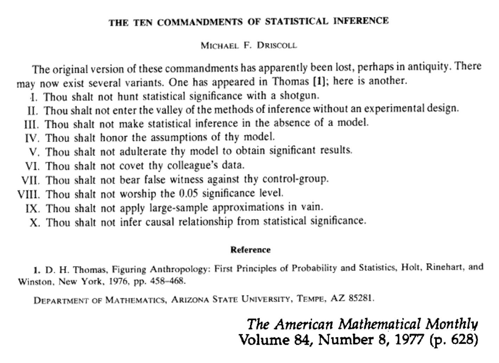
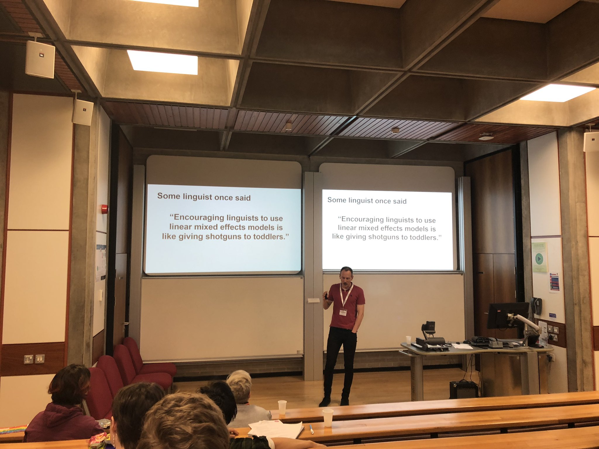

```{r setup, include=FALSE}
knitr::opts_chunk$set(echo = TRUE)


# 1. R and RStudio interfaces, RMarkdown, and best practices
#    - Basic functionality, shortcuts, writing scripts and notebooks, organising files, interfacing with GitHub
# 2. Data frame manipulation using Tidyverse
#    - Piping syntax and code replicability
#    - Tidyr, Dplyr, related packages
#    - Cleaning, combining, and rearranging data frames
# 3. Data visualisation using ggplot and best practices
#    - Structure and syntax of ggplot and geom
#    - Customising and combining plots
#    - Determining what plot is best for your data
# 4. Basic linear models without and with mixed effects (including gaussian, binomial, and ordinal)
#    - building/selecting an appropriate model, including random effect structures
#    - maximal vs parsimonious models
#    - practical use of lm(), lmer(), glm(), glmer(), clmm()
#    - dummy coding vs contrast coding
#    - interpreting the output
```

Download course materials from [here](https://github.com/VerbingNouns/...).

## Storytelling with data {.tabset}

> See **Simulated Data** notebook

```{r}
data <- read_csv("../data/simulated-data.csv")
```

```{r}
head(data)
```

### The Ten Commandments of Statistical Inference



### Continuous data

```{r}
library(lme4)
```

Build a simple linear model to examine region 3 (the verb):
```{r}
# summary(
#     lm ( DV ~ IV1 * IV2 + IV3 , data = data )
#        )
summary(lm(rt ~ freq * gram + age, data[data$region==3,]))
```

Add in mixed effects for a linear mixed effects model:
```{r}
#summary(
#  lmer( DV ~ IV1 * IV2 + IV3 + ( 1 | RV1 ) + ( 1 | RV2 ) , data = data)
#        )
summary(lmer(rt ~ freq+gram+freq:gram+age + (1|subj) + (1|item),data %>% filter(region==3)))
```


<small>Bodo Winter telling it like it is. (Photo credit: Adam Schembri 27/02/2019)</small>

We should do model comparison to assess the contribution of each of the factors to the overall fit. But, read the Bates et al and Barr et al papers for an overview of the debates around how to design and test models.

Let's do model comparison for region 3:
```{r}
mdl1.max <- lmer(rt ~ freq*gram + age + accuracy + (1|subj),data[data$region==3,])
mdl1.age <- lmer(rt ~ freq*gram + accuracy + (1|subj),data[data$region==3,])
mdl1.acc <- lmer(rt ~ freq*gram + age +  (1|subj),data[data$region==3,])
mdl1.int <- lmer(rt ~ freq+gram + age + accuracy + (1|subj),data[data$region==3,])
mdl1.frq <- lmer(rt ~ gram + age + accuracy + (1|subj),data[data$region==3,])
mdl1.grm <- lmer(rt ~ freq + age + accuracy + (1|subj),data[data$region==3,])

anova(mdl1.max,mdl1.age) # max vs age
anova(mdl1.max,mdl1.acc) # max vs acc
anova(mdl1.max,mdl1.int) # max vs int
anova(mdl1.int,mdl1.frq) # int vs frq
anova(mdl1.int,mdl1.grm) # int vs grm

```

How do regions 4 and 5 compare?:
```{r}

```

### Ordinal data

First, how could we go about using `lmer` for rating data?
```{r}
mdl.ord <- lmer(rating ~ freq*gram + (1|subj), data%>%filter(region==1))
summary(mdl.ord)
```

#### Better ordinal data

```{r}
library(ordinal)
```

For the ratings, build models like above, but using `clmm()` (these take a little longer to run):
```{r}
mdl.ord.clmm <- clmm(as.factor(rating) ~ freq*gram + age + (1|subj), data%>%filter(region==1))
summary(mdl.ord.clmm)
```

> See **visualising_ordinal_data.R** for Predicted Curves script

### Binomial data

```{r}
data %>%
  filter(region==1) %>%
  mutate(age_group = case_when(age<35~"young",
                               age>=35&age<=55~"middle",
                               age>55~"old")) %>%
  mutate(age_group = factor(age_group,levels=c("young","middle","old")))%>%
  group_by(freq,gram,age_group) %>%
  summarise(accuracy=sum(accuracy)/n()) %>%
  ggplot(aes(x=freq,fill=gram,y=accuracy))+
  geom_bar(stat="identity",position="dodge")+
  facet_wrap(~age_group)
```


Does accuracy change as a function of age?
```{r}
# summary(
#   glmer( DV ~ IV1 * IV2 + IV3 + ( 1 | RV1 ) + ( 1 | RV2 ), family="binomial", data = data)
# )
```

Do model comparison to assess the contribution of each of the factors to the overall fit:
```{r}

```
