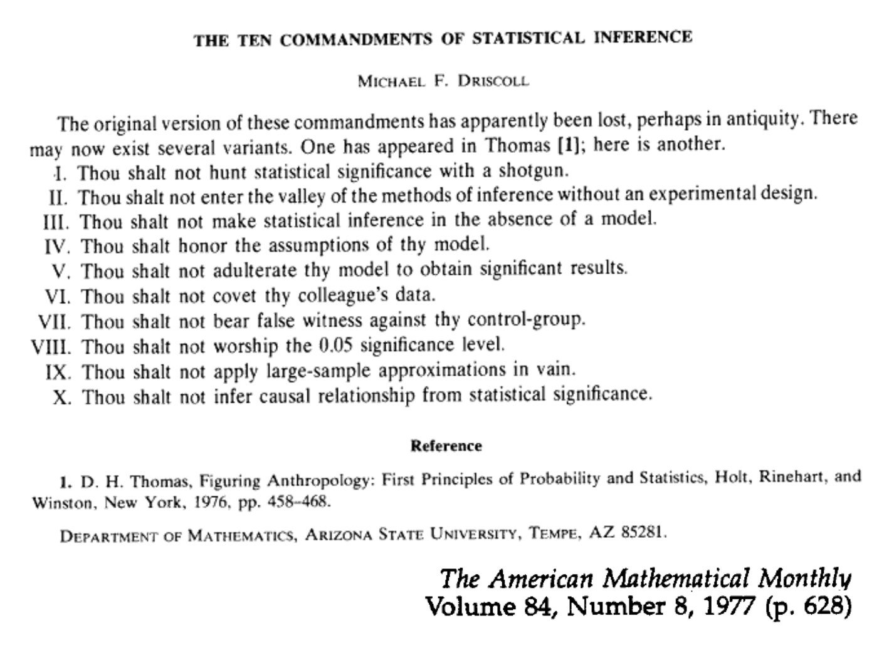

```{r setup, include=FALSE}
knitr::opts_chunk$set(echo = TRUE)
```

# Data Visualisation and Analysis  {.tabset}

Download course materials from [here](https://github.com/VerbingNouns/notebooks/blob/master/20190228_Workshop.zip).

 bit.ly/Leeds_2019-02-28

```{r, eval=FALSE}
install.packages(tidyverse,ordinal,lme4)
```


## Base R functionality {.tabset}

> Dataset `sleep`:

```{r}
head(sleep)
```

* column 1 = how many extra hours of sleep were recorded
* column 2 = which drug was administered
* column 3 = which participant

### Indices, or: finding the index of the value you want

What does this do?
```{r}
sleep[1,] # what's this do? (row 1)
```

How does this differ from `[1,]`?
```{r}
sleep[2,] # so that means this is row 2
```

How does this differ from `[3,]`?
```{r}
sleep[,3] # (column 3)
```

…which makes it `dataset[row,column]`

### More descriptive methods

You can also navigate with column names:
```{r}
sleep$ID
```

How would you view the column `extra`?
```{r}
sleep$extra
```

Use `str()` to get a summary of the structure of the dataset
```{r}
str(sleep)
```

What are all the unique values in `ID`?
```{r}
unique(sleep$extra)
```

What's the value in the first row, third column?
```{r}
sleep[1,3]
```

What's the first element in the column `ID`?
```{r}
sleep$ID[1]
```

You can also view the dataset as a spreadsheet (although it can't be altered).
```{r, eval=FALSE}
View(sleep)
```

## Tidyverse functionality {.tabset}

```{r}
library(tidyverse)
```

A `tibble` is different from a `table`.
```{r}
as.tibble(sleep)
```

> Pipes are like toy funnels

%>%


```{r}
sleep %>%
  head()

# or

sleep %>%
  head
```

How many attestations of each type of `group`?
```{r}
sleep %>%
  count(group)
```

How can you make a new column? Duplicate `group` into `group2`:
```{r}
sleep %>%
  mutate(group2 = group)
```

Let's rename the levels in `group` to be "one" and "two":
```{r}
sleep %>%
  mutate(group2 = case_when(group==1 ~ "one",
                            TRUE ~ "two"))
```


What's wrong with this one?
```{r}
sleep %>%
  mutate(group2 = case_when(group==1 ~ as.factor("one"),
                            group==2 ~ as.factor("two")))
```


```{r}
sleep %>%
  mutate(group2 = case_when(group==1 ~"one",
                            group==2 ~"two")) %>%
  mutate(group2 = as.factor(group2))
```


Now, let's recreate the `count` function with `group_by` and `summarise`:
```{r}
sleep %>%
  group_by(group) %>%
  summarise(n = n())
```


We cal use `group_by` and `summarise` to do a lot more than just count:
```{r}
# mean value of `extra` by `group2`
sleep %>%
  mutate(group2 = case_when(group==1 ~"one",
                            group==2 ~"two")) %>%
  mutate(group2 = as.factor(group2)) %>%
  group_by(group) %>%
  summarise(effectMean = mean(extra))
```


## Processing into tables

> Dataset `quakes`:

What does `quakes` look like?
```{r}
quakes %>%
  str
```

How many observations are there per "level" of magnitude?
```{r}
quakes %>%
  group_by(mag) %>%
  summarise(numberOfObvs = n())
```

Let's create a table of the means, standard deviations, and standard errors for both stations reporting and depths:
```{r}
quakes %>%
  group_by(mag) %>%
  summarise(numberOfObvs = n(),
            stationMean = mean(stations),
            stationSD = sd(stations),
            stationSE = sd(stations)/sqrt(numberOfObvs),
            depthMean = mean(depth),
            depthSD = sd(depth),
            depthSE = sd(depth)/sqrt(numberOfObvs))
```

This dataset is wide. Let's make it long using `gather` (compare to `spread`):
```{r}
quakes %>%
  group_by(mag) %>%
  summarise(numberOfObvs = n(),
            stationMean = mean(stations),
            stationSD = sd(stations),
            stationSE = sd(stations)/sqrt(numberOfObvs),
            depthMean = mean(depth),
            depthSD = sd(depth),
            depthSE = sd(depth)/sqrt(numberOfObvs)) %>%
  gather(measurement, values, 3:8)
```


## Basic ggplot2 {.tabset .tabset-pills}

```{r}
# https://bookdown.org/ndphillips/YaRrr/pirateplot.html
library(tidyverse)
# install.packages("ggbeeswarm")
library(ggbeeswarm)
```

> Dataset `iris`:

The function `ggplot` layers different geometries and aesthetics to build up a plot:
```{r}
iris %>%
  mutate(Sepal.Width = Sepal.Width+rnorm(length(Sepal.Width),0,.1))%>%
  ggplot(aes(x=Species,y=Sepal.Width,fill=Species)) +
  geom_violin(lty=0,alpha=.5)+
  geom_boxplot(alpha=0.5,lwd=.5) +
  geom_quasirandom(dodge.width=1, alpha=.5)
```

In what ways might we change this plot?
```{r}
iris %>%
  mutate(
    Sepal.Width = Sepal.Width + 
      rnorm(
        length(Sepal.Width) , 0 , .1
        )
    ) %>%
  ggplot(aes(x=Species,y=Sepal.Width)) +
  geom_boxplot() +
  geom_quasirandom(aes(pch=Species, colour=Species), alpha=.5, cex=3,) +
  theme_bw()
```


Going back to `quakes`, let's pipe our table into a ggplot (and fill in missing values):
```{r}
quakes %>%
  group_by(mag) %>%
  summarise(n=n(),
            sta=mean(stations),
            staSD=sd(stations),
            staSE=staSD/sqrt(n),
            dep=mean(depth),
            depSD=sd(depth),
            depSE=depSD/sqrt(n)) %>%
  ggplot(aes(x=mag)) +
  geom_point(aes(y=sta),colour="red")+
  geom_path(aes(y=sta),colour="red")+
  geom_ribbon(aes(ymin=sta-staSD,ymax=sta+staSD),fill="red",alpha=.2) +
  geom_ribbon(aes(ymin=sta-staSE,ymax=sta+staSE),fill="red",alpha=.5) +
  geom_point(aes(y=dep),colour="blue")+
  geom_path(aes(y=dep),colour="blue")+
  geom_ribbon(aes(ymin=dep-depSD,ymax=dep+depSD),fill="blue",alpha=.2) +
  geom_ribbon(aes(ymin=dep-depSE,ymax=dep+depSE),fill="blue",alpha=.5) +
  theme_bw() + ylab("depth OR number of stations reporting")
```


## Storytelling with data {.tabset}

> See **Simulated Data** notebook

```{r}
data <- read_csv("../data/simulated-data.csv")
```


### The Ten Commandments of Statistical Inference



### Exploration

Plot boxplots and violin plots for the ratings. Subset by participant.
```{r}
data %>%
  filter(region == 1) %>%
  ggplot(aes(x=gram, y=rating, fill=freq)) +
  geom_boxplot(position = position_dodge(.9)) +
  facet_wrap(~subj)
```

Group by region, word, frequency, and grammaticality. Summarise mean and standard error.
```{r}
data %>%
  group_by(region, word, freq, gram) %>%
  summarise(meanRT = mean(rt),
            seRT = sd(rt)/sqrt(n())) %>%
  ggplot(aes(x=region,y=meanRT,colour=gram)) +
    geom_point() +
    geom_path(aes(lty=freq)) +
    geom_errorbar(aes(ymin=meanRT-seRT, ymax=meanRT+seRT),width=.1) +
  scale_x_continuous(breaks=c(1:5),labels = c("the","old","VERB","the","boat")) +
  ylab("reading time (miliseconds)")
```

#### Why? 

Well, check out the [Datasaurus Dozen](https://www.autodeskresearch.com/publications/samestats), which all have the same x/y means and standard deviations:


### Continuous data

```{r}
library(lme4)
```

Build a simple linear model to examine region 3 (the verb):
```{r}
# summary(
#     lm ( DV ~ IV1 * IV2 + IV3 , data = data )
#        )
summary(lm(rt ~ freq * gram + age, 
           data[data$region==3,]))
```

Add in mixed effects for a linear mixed effects model:
```{r}
#summary(
#  lmer( DV ~ IV1 * IV2 + IV3 + ( 1 | RV1 ) + ( 1 | RV2 ) , data = data)
#        )
summary(lmer(rt ~ freq+gram+freq:gram+age + (1|subj) + (1|item),
             data %>% filter(region==3)))
```


<small>Bodo Winter telling it like it is. (Photo credit: Adam Schembri 27/02/2019)</small>

We should do model comparison to assess the contribution of each of the factors to the overall fit. But, read the Bates et al and Barr et al papers for an overview of the debates around how to design and test models.

Let's do model comparison for region 3:
```{r}
mdl1.max <- lmer(rt ~ freq*gram + age + accuracy + (1|subj),data[data$region==3,])
mdl1.age <- lmer(rt ~ freq*gram + accuracy + (1|subj),data[data$region==3,])
mdl1.acc <- lmer(rt ~ freq*gram + age +  (1|subj),data[data$region==3,])
mdl1.int <- lmer(rt ~ freq+gram + age + accuracy + (1|subj),data[data$region==3,])
mdl1.frq <- lmer(rt ~ gram + age + accuracy + (1|subj),data[data$region==3,])
mdl1.grm <- lmer(rt ~ freq + age + accuracy + (1|subj),data[data$region==3,])

anova(mdl1.max,mdl1.age) # max vs age
anova(mdl1.max,mdl1.acc) # max vs acc
anova(mdl1.max,mdl1.int) # max vs int
anova(mdl1.int,mdl1.frq) # int vs frq
anova(mdl1.int,mdl1.grm) # int vs grm

```

How do regions 4 and 5 compare?:
```{r}
mdl2.max <- lmer(rt ~ freq*gram + age + accuracy + (1|subj),data[data$region==4,])
mdl2.age <- lmer(rt ~ freq*gram + accuracy + (1|subj),data[data$region==4,])
mdl2.acc <- lmer(rt ~ freq*gram + age +  (1|subj),data[data$region==4,])
mdl2.int <- lmer(rt ~ freq+gram + age + accuracy + (1|subj),data[data$region==4,])
mdl2.frq <- lmer(rt ~ gram + age + accuracy + (1|subj),data[data$region==4,])
mdl2.grm <- lmer(rt ~ freq + age + accuracy + (1|subj),data[data$region==4,])

anova(mdl2.max,mdl2.age) # max vs age
anova(mdl2.max,mdl2.acc) # max vs acc
anova(mdl2.max,mdl2.int) # max vs int
anova(mdl2.int,mdl2.frq) # int vs frq
anova(mdl2.int,mdl2.grm) # int vs grm

mdl3.max <- lmer(rt ~ freq*gram + age + accuracy + (1|subj),data[data$region==5,])
mdl3.age <- lmer(rt ~ freq*gram + accuracy + (1|subj),data[data$region==5,])
mdl3.acc <- lmer(rt ~ freq*gram + age +  (1|subj),data[data$region==5,])
mdl3.int <- lmer(rt ~ freq+gram + age + accuracy + (1|subj),data[data$region==5,])
mdl3.frq <- lmer(rt ~ gram + age + accuracy + (1|subj),data[data$region==5,])
mdl3.grm <- lmer(rt ~ freq + age + accuracy + (1|subj),data[data$region==5,])

anova(mdl3.max,mdl3.age) # max vs age
anova(mdl3.max,mdl3.acc) # max vs acc
anova(mdl3.max,mdl3.int) # max vs int
anova(mdl3.int,mdl3.frq) # int vs frq
anova(mdl3.int,mdl3.grm) # int vs grm
```

### Ordinal data

First, how could we go about using `lmer` for rating data?
```{r}
mdl.ord <- lmer(rating ~ freq*gram + (1|subj), data%>%filter(region==1))
summary(mdl.ord)
```

#### Better ordinal data

```{r}
library(ordinal)
```

For the ratings, build models like above, but using `clmm()` (these take a little longer to run):
```{r}
mdl.ord.clmm <- clmm(as.factor(rating) ~ freq*gram + age + (1|subj), data%>%filter(region==1))
summary(mdl.ord.clmm)
```

> See **visualising_ordinal_data.R** for Predicted Curves script

### Binomial data

```{r}
data %>%
  filter(region==1) %>%
  mutate(age_group = case_when(age<35~"young",
                               age>=35&age<=55~"middle",
                               age>55~"old")) %>%
  mutate(age_group = factor(age_group,levels=c("young","middle","old")))%>%
  group_by(freq,gram,age_group) %>%
  summarise(accuracy=sum(accuracy)/n()) %>%
  ggplot(aes(x=freq,fill=gram,y=accuracy))+
  geom_bar(stat="identity",position="dodge")+
  facet_wrap(~age_group)
```


Does accuracy change as a function of age?
```{r}
# summary(
#   glmer( DV ~ IV1 * IV2 + IV3 + ( 1 | RV1 ) + ( 1 | RV2 ), family="binomial", data = data)
# )

summary(glmer(accuracy ~ age + (1|subj), family="binomial", data=data[data$region==1,]))
```

Do model comparison to assess the contribution of each of the factors to the overall fit:
```{r}
mdl4.max <- glmer(accuracy ~ freq*gram + age + (1|subj),data[data$region==1,], family="binomial")
mdl4.age <- glmer(accuracy ~ freq*gram + (1|subj),data[data$region==1,], family="binomial")
mdl4.int <- glmer(accuracy ~ freq+gram + age + (1|subj),data[data$region==1,], family="binomial")
mdl4.frq <- glmer(accuracy ~ gram + age + (1|subj),data[data$region==1,], family="binomial")
mdl4.grm <- glmer(accuracy ~ freq + age + (1|subj),data[data$region==1,], family="binomial")

anova(mdl4.max,mdl4.age) # max vs age
anova(mdl4.max,mdl4.int) # max vs int
anova(mdl4.int,mdl4.frq) # int vs frq
anova(mdl4.int,mdl4.grm) # int vs grm
```

