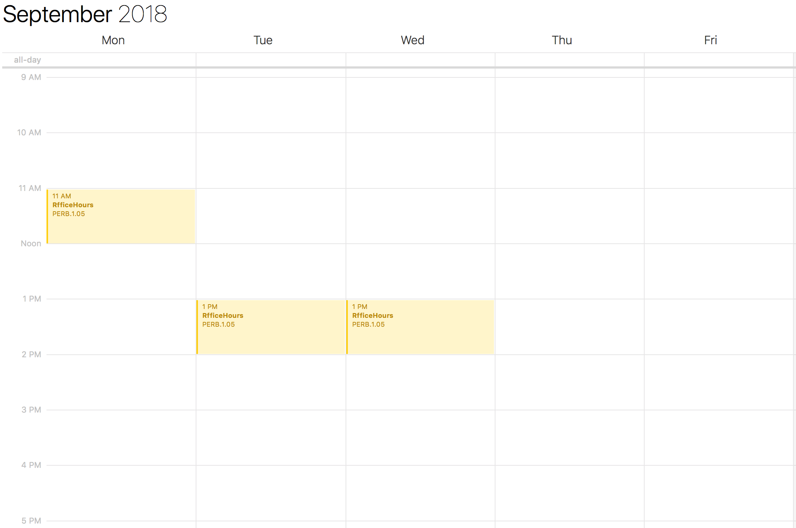

[🔙 Home](https://verbingnouns.github.io/notebooks/)

```{r, echo=FALSE}
htmltools::img(src = knitr::image_uri("header.png"), 
               alt = 'logo', 
               style = 'position:absolute; top:0; right:0; padding:20px;')
```

# Purpose {.tabset .tabset-pills}

While [R](https://cran.r-project.org/) and [RStudio](https://www.rstudio.com/products/rstudio/download/#download) are extremely powerful, flexible tools, they are only useful if you know how to get started. **RfficeHours** is a series of short seminars I will be offering in September 2018 to help staff at and nearby Newcastle University learn the basic functionality of R and how to explore further on their own.

## Design

We all have busy and variable schedules, particular at the begining of term time. Since we will never find one time that suits everyone, I will offer each seminar **three times**. Each week will feature three identical seminars. You are invited to attend as many as you'd like or as many as you can fit in. If you come to one and feel that you would benefit from hearing the lesson again (or running through it again with your own data, etc), I invite you to attend twice or more per week!

This will not be the last time I organise RfficeHours, so if you can't attend any of the seminars this time, you are not out of luck. Hopefully, RfficeHours will become an extension of the [Adventures In R](https://verbingnouns.github.io/AdventuresInR/) workshop(s).

## Schedule

Week beginning **17 September**:

1. *File management and datasets*  
    * Navigating files structures in RStudio  
    * Reading and writing files  
    * Rmarkdown and verbose programming  
* Monday 17 Sept 13:00  
* Tuesday 18 Sept 14:00
* Thursday 20 Sept 11:00

---

Week beginning **24 September**:

2. *Intro to Tidyverse*  
    * Basic data manipulation  
    * Summarising a data table  
    * Ingredients of a ggplot  
* Monday 24 Sept 13:00  
* Tuesday 25 Sept 14:00
* Thursday 27 Sept 11:00

---

Week beginning **1 October** (yes I know this is term-time...):

3. *Exploration and troubleshooting*  
    * Thinking like a programmer  
    * Reading CRAN documentation  
    * Intro to GitHub and StackOverflow  
* Monday 1 Oct 13:00  
* Tuesday 2 Oct 14:00
* Thursday 4 Oct 11:00

---

## Location

**Mondays**: TBD  
**Tuesdays**: TBD  
(it will depend on when timetables are released, how much interest is expressed, and whether I can book a room on campus)

**Thursdays**: Percy Building 2.05  


# Contact

If you are interested in hearing more about this as the time approaches, email me at [lauren.ackerman@ncl.ac.uk](mailto:lauren.ackerman@ncl.ac.uk) and I will be in touch.


---


