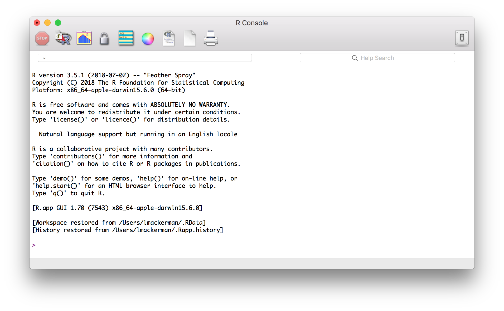
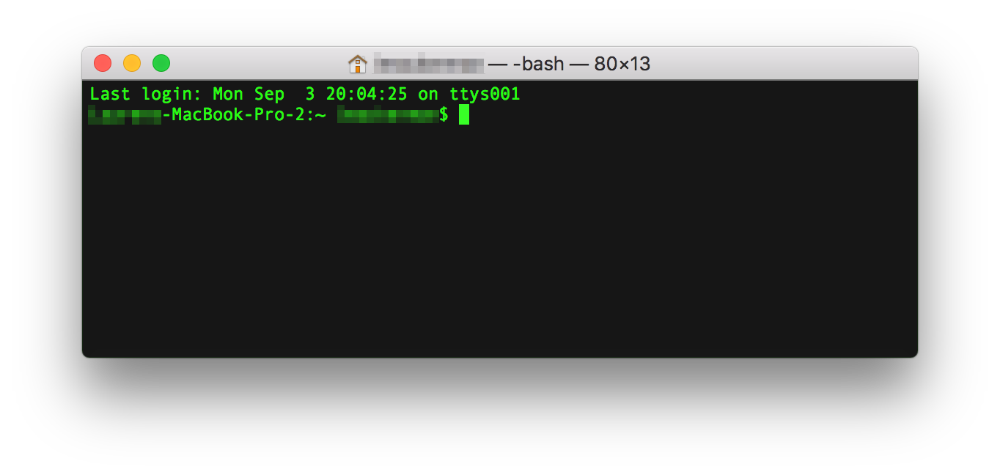
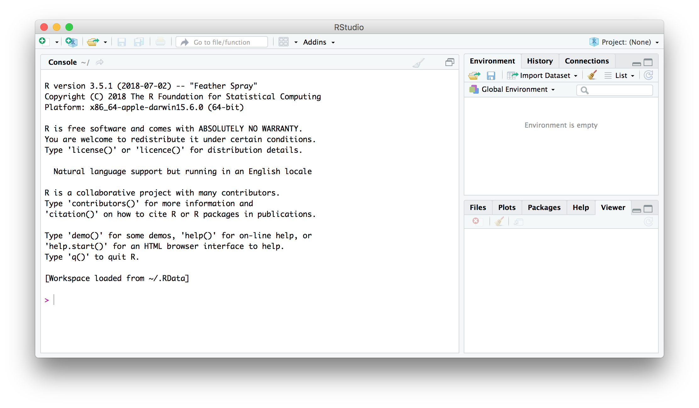
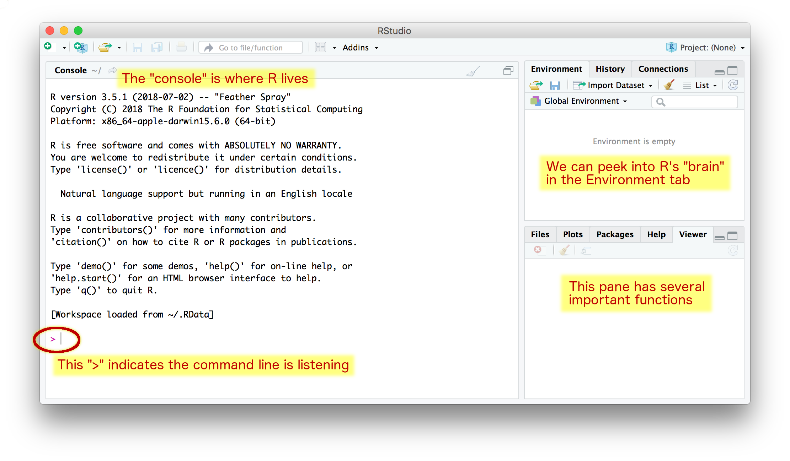
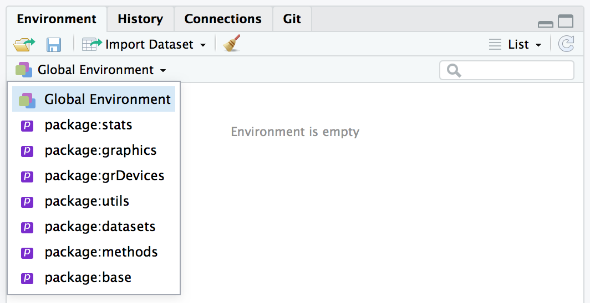
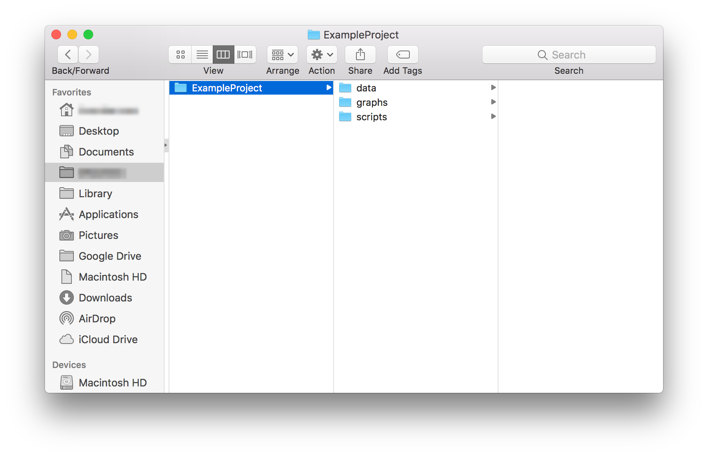
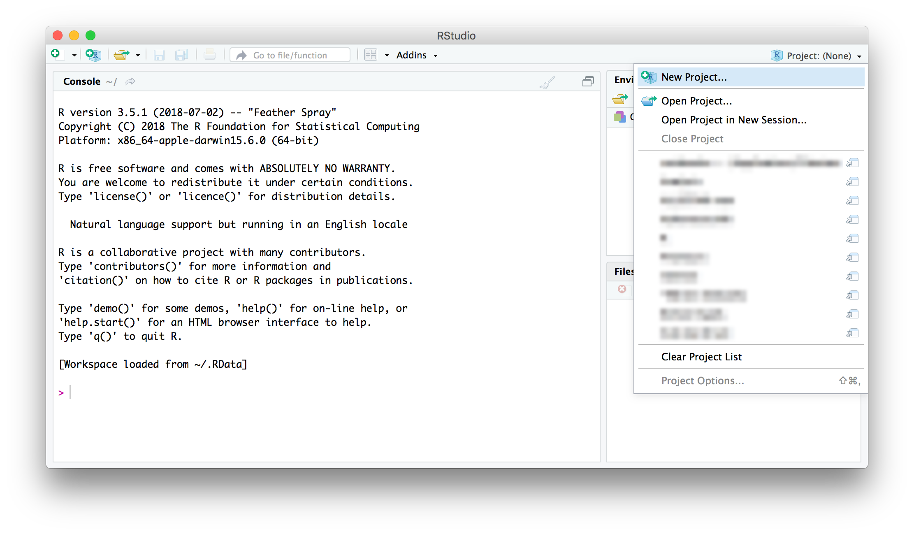
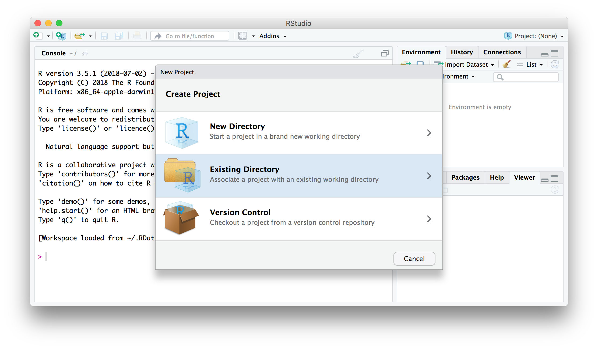
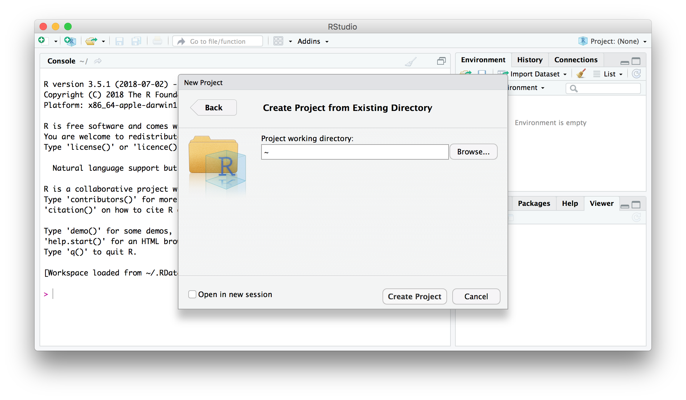
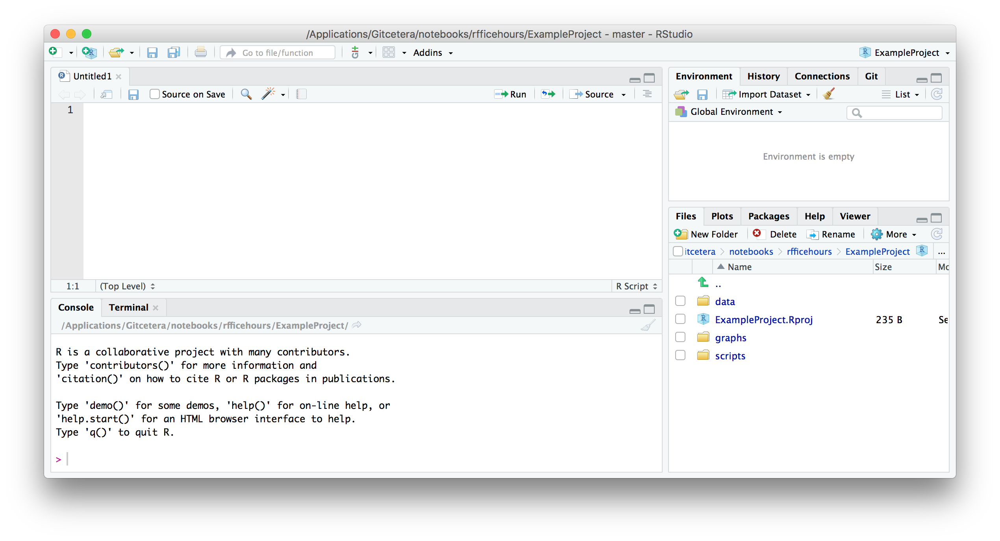

[⇠ RfficeHours Home](info.html) || [Tutorial 2 ⇢](tutorial-2.html)

```{r, echo=FALSE}
htmltools::img(src = knitr::image_uri("header.png"), 
               alt = 'logo', 
               style = 'position:absolute; top:0; right:0; padding:20px;')
```

```{r setup, include=FALSE}
knitr::opts_chunk$set(echo = TRUE)
```


|  |Learning Outcomes|
|--|----------|
|1|<span style="background-color: #FFFF00">You will be able to open RStudio and know where to find basic functions</span>|
|2|<span style="background-color: #FFFF00">You will be able to create and organise a new project</span>|
|3|<span style="background-color: #FFFF00">You will be able to load your data into R and view it</span>|
|4|<span style="background-color: #FFFF00">You will know the purpose and of code annotation and commenting</span>|
|||

# File structure

Before you can use R and RStudio, it's important to understand what you're looking at and where to find things.

## R vs RStudio

### What is the difference between R and RStudio?

**R** is the program and programming language that allows you to input commands and get the computer to do things. In order to interact with R, some people use a simple R interface, some people use the command line, and some people use RStudio.

**RStudio** is a GUI (Graphical User Interface) that allows you to interact with R and keep everything organised.







We'll be using **RStudio** because it is the easiest to use, with some point-and-click commands, but still with the full functionality and power of R. R runs in the background when you run RStudio, but RStudio takes care of that on its own so all you need to do is open RStudio.

### What is going on in the RStudio window?

The RStudio interface has (up to) four panes that you can rearrange and customise to suit your needs. Here is the default configuration:



When you open RStudio for the first time, there may only be three panes.

#### The Console

The console is your direct line of communication with R. It operates a bit like a chat window (if you're familiar with that) because you can type things into the console, hit `ENTER`, and R will do something (and sometimes, depending on what you type, it'll respond). You know the console is listening and ready to accept a new command if you see a `>` on the left edge of the window on the lowest line of text.

#### Environment

The environment is a set of three tabs that effectively lets us see into "R's brain" (thanks Danielle!). This window lets you see what variables you've created, what datasets are loaded in, what packages and libraries are loaded, among many other things. Right now, it's empty.

If we click on `Global Environment`, we can see what packages have automatically be loaded into this R session. Once you load other packages in, you will see them here too.



#### Files etc

The pane in the lower right has five tabs by default.

1. **Files**  
    - This tab will show you what files are in the folders you navigate to.  
    - This is useful if you want to preview a dataset, open a script, or figure out where you saved something.  
2. **Plots**  
    - This tab will display plots you generate from the console.  
    - You can click `Zoom` to pop the graph out into a separate window and resize it.  
    - You can click `Export` to save the plot as a PNG, PDF, EPS, etc.  
3. **Packages**  
    - In this tab, you can see what packages have been downloaded and loaded.
4. **Help**  
    - This tab will let you look through the documentation and get tips on how to use different functions.
5. **Viewer**  
    - I've never used this.  

### How do you keep all your related files organised?

Keeping your files organised will make your life infinitely easier and will help you ease back into using R if you come back to it after a hiatus. The RStudio interface will help with this, but there is no better foundation than good file management.

#### Your project folder

[Danielle Turton]() and I suggest the following as a best practice:

1. Create a folder with the name of your project.  
    - If possible, do not use SPACES or SPECIAL CHARACTERS. These can cause issues across platforms.  
    - If you want to separate words, use UNDERSCORES (_), HYPHENS (-), or CamelCase.  
2. Within your project folder, create three subfolders.  
    - **data**: This is the place you'll store all your datasets and spreadsheets.  
    - **graphs**: This is the place you'll save the outputs of your script.  
    - **scripts**: This is the place you'll save your R scripts and notebooks.  
3. Name all scripts, graphs, and datasets using the following templates:  
    - YYYYMMDD-descriptive_name.R  
    - YYYYMMDD-name_of_generating_script_or_dataset.PNG  
    - YYYYMMDD-dataset_name_or_source.csv (or .txt)  




#### Creating an .RProj

RStudio offers a neat feature called a *project* (file type `.Rproj`). A project keeps all your scripts and datasets handy and can save variables for use later, even if you quit and restart RStudio. This can be useful if you are running complex models, for instance.

To create a new project, click on the small triangle in the upper right corner of the RStudio window.



This will bring up a menu with a number of useful options, but right now, we want to create a *New Project...*



Since we have already created a folder (i.e., a directory) for our project, we can click on the *Existing Directory* option. If you haven't created a folder for your project, you can create a new directory, but in this case you should still follow best practices for file organisation.



From this window, we can browse our computers for the location of the folder we've set up.

#### Troubleshooting

I have noticed that sometimes students whose computers are set up with a non-English language, particularly with a non-Latin alphabet, can run into problems with setting up these folders. It is important to instruct them to use only Latin characters for the folders that R and RStudio will access, as non-Latin characters use a type of encoding that not all programs can read.

## Scripts

Scripts will appear in the fourth pane (top left by default). 



Scripts are simply text files, they are not R and they don't do anything unless you perform specific actions on them. They're a bit like instruction manuals, but R can only read them if you manually send the instructions to the console (more on this later).

### What is the point of a script?

**A script is a way to save your work so you only need to write the code once.** Once you've written a script once, you can execute it as many times as you like, but you won't need to *write* it again. You can copy and paste other people's code into your script and tweak it to fit your needs. You can debug your code without having to type it in new each time. You can share your code with others, and you can leave comments to yourself in your code so that you can leave it sit for a while and then remember what you were doing when you come back to it.

### How do you write a new script?

On all platforms: the green + symbol in the top left corner will let you create a new script.

On a Mac: `command`+`shift`+`N`  
On a PC:  

The symbol `#` hides the text that follows on that line from R, that is, it "comments it out". This lets you write comments to yourself and to anyone else who might read your code. You'll want to do this so you can remember what you were doing (*trust* me, you will not remember) and so other people can replicate what you did (even if it's just to help you debug your code later).

If you type `print("Hello World!")` (with a nice comment) and then hit `ENTER` in your console, you will see something like this:

```
> print("Hello World!") # this line will produce the text between the quotes
```
`[1] "Hello World!"`

If you type `print("Hello World!")` and hit `ENTER` in a script, you will see something like this:

```
print("Hello World!")  
 
```

(Note that nothing happens. There is no output. A script is just a text file.)

### How do you use a script?

Open a new script and type `print("Hello World!")` into it. How do you get R to execute your code? There are a couple ways:  

- Click the `Run` button on the top right portion of the script pane.
    - This will run everything in your script.
- Use a keyboard shortcut
    - To run only the line your cursor is on, `Command`+`Enter`
    - To run only the selected code, select some code and use `Command`+`Enter`
    - To run the entire script, `Command`+`Shift`+`Enter`

When you run a script, the text in the script is sent, line by line, to the console. Once in the console, R executes the code. You can watch the code progress in the console. If there is any text or numerical output, it will appear in the console. If there is a graphical output, it will appear in the Plots tab of the lower right pane (Files etc).

### Try it for yourself

1. Create a new script.
2. Save and name the script appropriately. (YYYYMMDD-descriptive_name.R)
3. In the script, enter the following code:  
```
print("Hello world!")
3 + 4
7^2
```
4. Run the entire script.

Your console should end up looking like this:  
```
> print("Hello world!")
[1] "Hello world!"
> 3 + 4
[1] 7
> 7^2
[1] 49
>
```

**What does `[1]` mean?**

The number in square brackets to the left of the output indicates the number of values that have been printed by index number. That is, if there are multiple outputs on one line, [1] will appear. If the seventh output wraps around and appears on the second line, both [1] and [7] will appear. This is useful when trying to make sense of long lists of numbers, for instance.

## Best practices
Best practices for file organisation

# Reading and writing
Reading and writing files

## Scripts
Opening and creating scripts

## Datasets
Opening datasets

### Tab-delimited files (.txt)

### Comma separated values (.csv)

### Why not Excel? (.xls/.xlsx)

# Literate programming
Rmarkdown and literate programming

## Annotation
Why do we annotate code?

## Prose
What is literate programming?

## R Notebooks

### Organising code

### Sharing code

### Publishing code

---