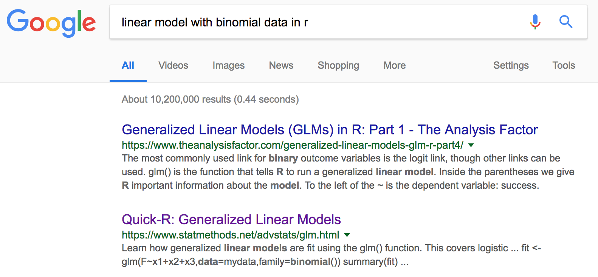
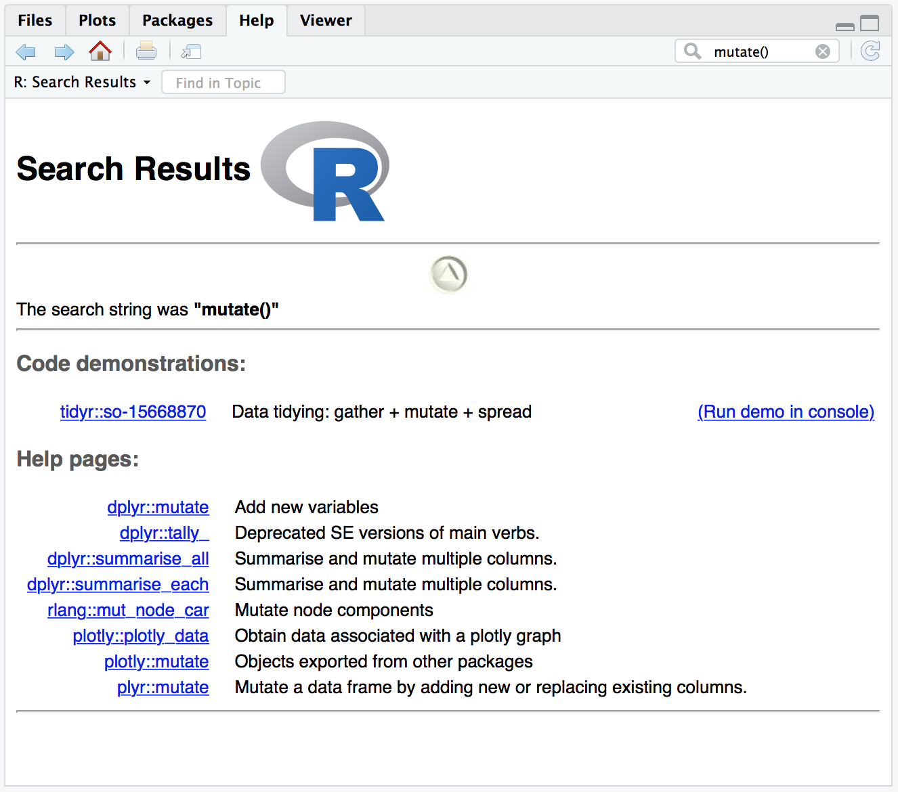
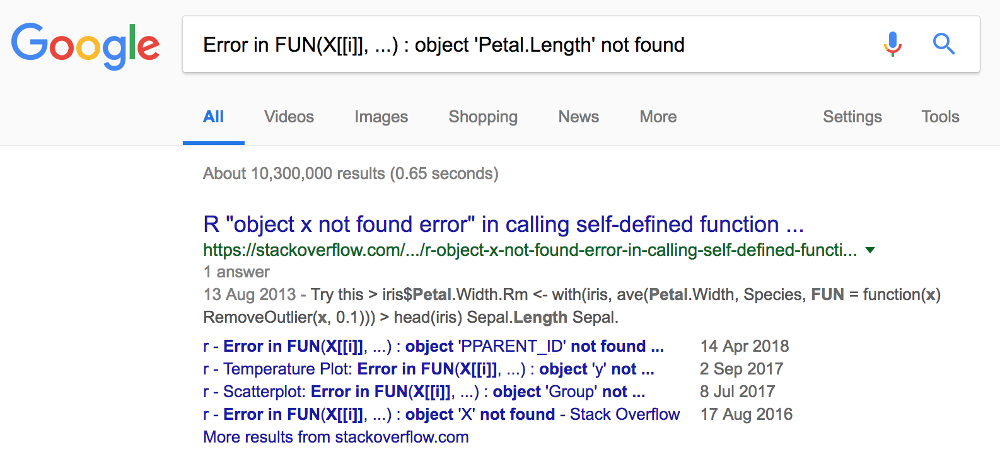

[⇠ Turorial 2](tutorial-2.html)

```{r, echo=FALSE}
htmltools::img(src = knitr::image_uri("header.png"), 
               alt = 'logo', 
               style = 'position:absolute; top:0; right:0; padding:20px;')
```

```{r setup, include=FALSE}
knitr::opts_chunk$set(echo = TRUE)
```

|  | Learning Outcomes |
|--|----------|
| 1|<span style="background-color: #FFFF00">You will know how to plan out code in a step-wise manner</span>|
| 2|<span style="background-color: #FFFF00">You will be able to navigate the CRAN documentation pages</span>|
| 3|<span style="background-color: #FFFF00">You will know how to search online for solutions</span>|
| 4|<span style="background-color: #FFFF00">You will realise that being good at R is being good at search engines</span>|
|||


# Planning code

In order to write effective code in any language, you must start to think like a programmer. This is a lot easier than it might sound. Programmers approach problems in a step-wise manner, which allows them to figure out and plan each step of the solution. When they come up against a step that they can't implement right away, it might indicate that the step is actually too complex as written out and needs to be broken into smaller chunks. It's also possible that it's the right sized chunk, but they just don't know the function to accomplish the step. In that case, there is probably a specific search term they can use to figure out how other people may have dealt with the same issue. In either case, this type of workflow will help you feel more comfortable with using R or any computer programming language you might be interested in.

## Strategise

**What is your goal?** As you are designing your code, decide what you want your code to do. Be as specific as you can, but if you aren't certain at this point, it'll become clear later on what needs to be elaborated.

> I want to analyze my binomial data.

1. I will need to know the data structure.
    - I should load my data in and explore it, either visually or textually
2. I will need to find an appropriate statistical measure
3. I will need to use the proper R syntax
    - I may need to look up the proper syntax
    - I may need to learn a new function or a new argument for a function
    - I may need to learn more about the statistical method
4. I will need to execute the code
    - I may need to debug the code
5. I will need to interpret the output
    - I may need help if I am unfamiliar with the output's formatting


## Test

**What code do you need to achieve your goal?** What does each line do, and how does it contribute to your progress? You may end up copying code from other sources or even from code you have written previously. Does each line add to your project, or are some optional? You can determine this by running each line individually, or even running a portion of a line to see what will happen.

```{r, eval=FALSE}
data <- read.csv("data/binomial-data.csv", header=TRUE)
```
```{r, echo=FALSE, message=FALSE}
data <- read.csv("ExampleProject/data/binomial-data.csv", header=TRUE)
```

What happens if you run the wrong code and get an error? What should you do if you run the code but don't understand the output?

```{r, error=TRUE}
glm(selection ~ condition * experiment)
```

```{r, error=TRUE, warning=FALSE}
glm(selection ~ condition * experiment, data=data)
```

```{r}
glm(selection ~ condition * experiment, data=data, family="binomial")
```

## Run

Once you've assembled your code and tested each part, it's time to run the whole thing. Before you do this, I recommend clearing out your global environment and starting fresh. Doing this will ensure you aren't accidentally calling a variable you created earlier but is no longer part of your code. To do this, you can click the small broom icon in the global environment pane. 

You can also use the remove function `rm()` with any variable names as arguments to remove them individually.

```{r}
rm(data, model1)
```

Then, once you've cleared everything out, you can run your code from the top and generate it fresh. If this works, it also means your code can be shared in its current form (with collaborators, students, reviewers, etc). This is a success!

## Example

Let's say you have data like `binomial-data.csv` and you want to determine whether the Baseline and Treatment conditions behave the same way in each of the three experiments. What do you need to do to implement this analysis? Let's work backwards:

> **Goal**: compare difference between conditions across three experiments

Let's break this down. In order to do this, setting aside statistical issues for the moment, we must first import the data. (Yes, we must break it down to this level of concreteness!)

```{r, eval=FALSE}
data <- read.csv("data/binomial-data.csv", header=TRUE)
head(data)
```
```{r, echo=FALSE, message=FALSE}
data <- read.csv("ExampleProject/data/binomial-data.csv", header=TRUE)
head(data)
```

Now what? Compare the three experiments! Or, wait… what does it mean to compare the three experiments? Let's get an idea of what the data structure is first, so we know what we're dealing with.

```{r}
str(data)
```

Okay, so we've got binary responses (`1`s and `0`s, or Option 1 and Option 2), two conditions ("Baseline" and "Treatment"), three experiments, and information about subjects and items. Now what?

Well, we could try building a linear model of our binomial data. How do we do that? Let's search the documentation.

What do we search the documentation for, though? Let's check a search engine first:



Excellent, let's see what the documentation for glm() looks like:

```{r}
?glm
```

Here's the function and its arguments from the documentation:

```
glm(formula, family = gaussian, data, weights, subset,
    na.action, start = NULL, etastart, mustart, offset,
    control = list(...), model = TRUE, method = "glm.fit",
    x = FALSE, y = TRUE, singular.ok = TRUE, contrasts = NULL, ...)
```

In short, it looks like we can create a linear model for our data like so (given that we're familiar with [the syntax for a linear model](https://verbingnouns.github.io/AdventuresInR/docs/Session_4-AnalysingData.nb.html)):

```{r}
glm(formula = selectCode ~ condition*experiment,
    family="binomial",
    data=data)
```

This output isn't useful for us! At the bottom of the documentation page, however, there's some sample code we might modify:

```
## an example with offsets from Venables & Ripley (2002, p.189)
utils::data(anorexia, package = "MASS")

anorex.1 <- glm(Postwt ~ Prewt + Treat + offset(Prewt),
                family = gaussian, data = anorexia)
summary(anorex.1)
```

Looks like we should save our model under a variable name then use the function `summary()` to view the output properly. Let's try it.

```{r}
model1 <- glm(formula = selectCode ~ condition*experiment,
              family="binomial",
              data=data)
summary(model1)
```

Well, that's something. But how do we interpret it? More importantly, is it really informative regarding our question? Since we've added interactions into the analysis, this complicates the interpretation so we may want to try something else to get at an answer about the behaviour across the experiments.

We could try visual comparison:

```{r}
library(tidyverse)
data %>%
  group_by(experiment,condition,selection) %>%
  summarise(count = n(),
            length = 240) %>%
  mutate(proportion = count/length) %>%
  ggplot(aes(x=condition, fill=selection)) +
    geom_bar(aes(y=proportion), stat="identity", colour="grey40") + 
    theme_bw() +
    ggtitle("Comparison of Conditions across the three Experiments") +
    facet_wrap(~experiment)
```

It looks plausible that the *first* and *second* experiment have similar behaviour, but that is visually very different from what's happening in the *third* experiment.

> What statistical analysis would you want to do to determine whether the behaviour observed in the *first*, *second*, and *third* experiments differs or not?

# CRAN documentation

CRAN stands for **The Comprehensive R Archive Network** and is available both online and through any R packages you have installed on your computer. Not every R package is available through CRAN, but most are and the ones that are are most likely to be well-tested and bug-free. To search CRAN documentation, you can type the `?` symbol before the function name you want to learn about (e.g., `?ggplot`), you can search in the *Help* tab of the lower right pane, or you can search online.

Let's say you want to learn (or remember!) how to use `mutate()`, part of the dplyr package.



It looks like there are a few things that might match, but since we know we want the dplyr version, we can click on that to get to the proper documentation page.

> **Description**  
> `mutate()` adds new variables and preserves existing; `transmute()` drops existing variables.

Great, that's clear enough if you vaguely understand what it does to begin with, but we need more information.

## Formulas

> **Usage**  
> `mutate(.data, ...)`  
`transmute(.data, ...)`

What does this mean? This is part of the documentation that describes the syntax and arguments of the function (or in this case, functions), but it only lists one, `.data`, which is weird for a few reasons. What does the `.` mean? What are the other arguments? The following section will start to clarify this.

## Arguments

> **Arguments**  
> `.data` \ \ \ \ A tbl. All main verbs are S3 generics and provide methods for `tbl_df()`, `dtplyr::tbl_dt()` and `dbplyr::tbl_dbi()`.  
> `...` \ \ \ \ Name-value pairs of expressions. Use `NULL` to drop a variable.
These arguments are automatically quoted and evaluated in the context of the data frame. They support unquoting and splicing. See `vignette("programming")` for an introduction to these concepts.

So when we see `.data` in the formula, we know we need to feed `mutate()` a variable of type "tbl" (which could be a table or a tibble, etc.). Since dplyr is part of the tidyverse, we can also assume that the `.` in front of `data` is indicating that this argument is the one that would need to be piped in from preceding code, if that's the set-up you're using.

Also, when we see `...`, we know that we also need to specify at least one pair of expressions consisting of a name and a value. We could examine the vignette, or we could just jump down to the bottom of the documentation page to look at the examples.

## Examples

> **Examples**  
```
# Newly created variables are available immediately  
mtcars %>% as_tibble() %>% mutate(  
  cyl2 = cyl * 2,  
  cyl4 = cyl2 * 2  
)  
```

In the first example, we can see the dataset `mtcars` is being used. Let's see what that's all about (i.e., let's **test** this bit of code)

```{r}
mtcars %>% as_tibble()
```

Now we can add in parts of the sample `mutate()` code one pair of expressions at a time:

```{r}
# Newly created variables are available immediately  
mtcars %>% as_tibble() %>% mutate(  
  cyl2 = cyl * 2
)
```

And the second pair of expressions:

```{r}
# Newly created variables are available immediately  
mtcars %>% as_tibble() %>% mutate(  
  cyl2 = cyl * 2,  
  cyl4 = cyl2 * 2  
)
```

(This last bit makes the table too wide to display in this web format, but on your own computer you can see the final column you just created.)

There's another example following the first that might be of interest. Let's check this one out too.

```
# You can also use mutate() to remove variables and  
# modify existing variables  
mtcars %>% as_tibble() %>% mutate(  
  mpg = NULL,  
  disp = disp * 0.0163871 # convert to litres  
)
```
The first pair of expressions is `mpg = NULL`, which sounds like it will either fill the `mpg` column with the value `NULL` or remove the whole column. Let's find out...

```{r}
mtcars %>% as_tibble() %>% mutate(  
  mpg = NULL
)
```

It appears to be gone! Now we can add in the second pair of expressions and see what that does (ostensibly converts `disp` from gallons to litres):

```{r}
mtcars %>% as_tibble() %>% mutate(  
  mpg = NULL,  
  disp = disp * 0.0163871 # convert to litres  
)
```

Notice how we don't have a new column, but rather the old column was changed. Now we can apply these functions to our own data. We could also continue to play around with the examples if we haven't yet found the application we're looking for.

# Online resources

When you aren't sure how to proceed, your search engine of choice will become your best friend. Two of the most useful sites are Stack Overflow and GitHub.

## Stack Overflow

```{r, echo=FALSE}
htmltools::img(src = knitr::image_uri("images/stackoverflow.png"), 
               alt = 'readr', 
               width = 150,
               style = 'position:right; top:0; right:0; padding:0px;')
```

Stack Overflow is a question and answer site, part of the Stack Exchange network, which you will become fairly familiar with as you continue to learn R as its focus is programming and software questions. It can be intimidating at first, and it tends toward the '*brogrammer*' type, but it is incredibly useful and responsive if you learn how to use it.

[Take the official site tour.](https://stackoverflow.com/tour)

### Searching for answers

Often, simply typing your question in Google will bring up Stack Overflow answers.

If your code returns an error, sometimes the best way to fix it is to search for the error, verbatim.

```{r, error=TRUE, warning=FALSE, fig.show='hide'}
iris %>%
  transmute(Sepal.Area = Sepal.Length * Sepal.Width) %>%
  ggplot(aes(Petal.Length, Sepal.Area)) +
    geom_point()
```

Hmm, not sure why I got an error, so I copy it directly into my search engine:



Looks like a lot of people have asked about this over the years, so I'm in luck!

As I go through the answers, I may realise that a lot of them are not relevant to me, but along the way I may also see a trend: solutions mostly suggest that there's either a typographical error or the shape of the data being passed to the graph isn't supported by the code. Let's see what I'm passing to `ggplot`, then.

```{r, error=TRUE, warning=FALSE}
iris %>%
  transmute(Sepal.Area = Sepal.Length * Sepal.Width) %>%
  head()
```

OH!!! Now we can see that we've used **transmute**, so the other columns we wanted were discarded. Let's use **mutate** instead.

```{r, error=TRUE, warning=FALSE}
iris %>%
  mutate(Sepal.Area = Sepal.Length * Sepal.Width) %>%
  ggplot(aes(Petal.Length, Sepal.Area)) +
    geom_point()
```

Problem solved!

### Asking questions

Sometimes you won't be able to find an answer right away. If you want to post something of your own to Stack Overflow, there are a few important things to note. 

First, you must post a question. This may seem obvious, but if you ask for help without specifying what you need help with, your "question" will be deleted.

Second, you need to include code that other people can run and reproduce the error. This means you may need to reproduce the error on your own with some of the sample datasets (or make your own dataset that you can share). This is another reason R includes the toy datasets such as `mtcars` and `iris` by default.

Here is some official guidance:  
[How to create a minimum, complete, verifiable example.](https://stackoverflow.com/help/mcve)

And some unofficial guidance:  
[How to ask a good question.](https://stackoverflow.com/questions/5963269/how-to-make-a-great-r-reproducible-example/5963610#5963610)

### Pitfalls

Some of the issues with Stack Overflow are easy to avoid, such as making sure you provide a reproducible example. A more troublesome problem is if you can't find an answer that seems to parallel your question (and you don't want to or can't post your own question). In this case, we can try a few other things.

If we get a large number of warnings or errors, we may be able to view the traceback (i.e., the list of messages that led up to the code crashing).

```{r, error=TRUE, warning=TRUE, message=TRUE, fig.show='hide'}
iris %>%
  transmute(Sepal.Area = Sepal.Length * Sepal.Width) %>%
  ggplot(aes(Petal.Length, Sepal.Area)) +
    geom_point()
```

```
Error in FUN(X[[i]], ...) : object 'Petal.Length' not found

11. FUN(X[[i]], ...)
10. lapply(aesthetics[new_aesthetics], rlang::eval_tidy, data = data)
9. scales_add_defaults(plot$scales, data, aesthetics, plot$plot_env)
8. f(..., self = self)
7. l$compute_aesthetics(d, plot)
6. f(l = layers[[i]], d = data[[i]])
5. by_layer(function(l, d) l$compute_aesthetics(d, plot))
4. ggplot_build.ggplot(x)
3. ggplot_build(x)
2. print.ggplot(x)
1. function (x, ...) UseMethod("print")(x)
```

If we can read through the traceback, we may be able to pinpoint the problem in another way. Then, our search might be more fruitful.

In the end, you may have to try searching for several different things to find something truly useful. Just remember **this is what professionals do too**.

## GitHub

Another useful website is GitHub, which is a combination of a data/code respository and a community forum. Many questions you have may be answered somewhere in GitHub, similarly to Stack Overflow, but here we'll talk about some of its other uses.

### What is GitHub?

**Git** is a computer programming language for version control. This is similar to the "Track Changes" option in Microsoft Word, but for any kind of file. Learning git is optional for using GitHub, although it can be very useful too. [Resource for learning how to use git.](https://learngitbranching.js.org)

If you don't want to learn git, you can use the web interface, the desktop app, or a number of other interfaces (including RStudio). [Help with connecting RStudio to GitHub.](http://happygitwithr.com/)

### Basics

What do you actually need to know to make use of GitHub? The terminology can be pretty impenetrable, so here is a very brief primer.

#### Repo (Repository)

A repository is a lot like an R project in several ways. First, it is a collection of files that are all related in some way and may contain files within folders and a range of file types. If you find a repository that you want to play around with on your own, you can **clone** or download the repository to your own account or to your own computer and the original files will remain untouched. If you are collaborating with someone on this repository, you can also create a **branch**, which is sort of like a parallel universe of the original files. You can edit them and change them, but the originals will remain untouched. Later, if you and your collaborators choose to, your branch can be **merged** back into the "master" branch, at which point the original files *will* be changed. However, git keeps a version history so you can always revert those changes. 

This is useful for more than just code! Storing manuscripts in GitHub repos is also great for making sure you never lose your work.

#### Commit

A noun or a verb, a commit is a bit like "saving" your work, at least locally. You might not see the change on the website's version of the files after you make a commit, but you've effectively saved your work. 

#### Push

In order to update the website's version of the files, you'll need to **push** your commit to the repository. This basically means you are sending your new saved version of whichever file or files you've changed to overwrite the current version. Luckily, the changes are also documented, so even though the file will be overwritten, you can always revert to a previous version.

#### Pull

A pull, on the other hand, takes the current version of the file from the website and overwrites the version you have stored locally (e.g., on your computer). Since the version of the file on your computer might not have been saved, it is important to note that you can't always revert to a previous version after a pull if it changes the file on your computer. That said, there are built-in mechanisms to prevent overwriting data. GitHub should (*should*) recognise that the repository version is different from the local version and warn you that there are updates. In some cases, it may give you the option to create a branch so that you don't lose the changes you've made to the local file which would be overwritten by the version in the repository. This may happen if you are collaborating simultaneously with other authors. Luckily, you can **merge** your branches later and not lose anyone's contribution. 

### Getting help

GitHub offers a lot of community services, ranging from R packages that are still in development (i.e., not available through CRAN yet) to question and answer fora. In particular, if you are using someone else's code from GitHub and run into a problem, you can raise an **issue** and they will be notified that you need help troubleshooting their code. [Here are some tips on how to do so.](https://gist.github.com/ccannon94/4980dc78456cb7a7ab38028e933cb01e)


