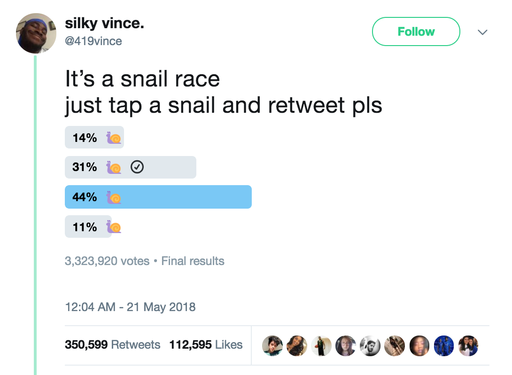

[🔙 Home](https://verbingnouns.github.io/notebooks/)

Snail races are a phenomenon on Twitter in which a Twitter poll is created in which all four of the possible options are labeled simply with the snail emoji (🐌). These polls can get very popular, and are noted to consistently have the same shape of responses. This notebook explores the consistency of Snail Race polls. It has been updated to demonstrate current `tidyverse` coding practices.



Packages used:  
```{r}
library(cowplot)
library(tidyverse)
```

# Read in the data

As a way of procrastinating, I recorded the results of 150 "snail races" on [Twitter](https://twitter.com/search?q=snail%20race&src=typd). Not all of these polls had closed, and the poll status is recorded in this dataset. In the future, the open polls can be updated.


```{r}
snail <- read_csv("data/snail_race.csv"); snail
```

But what we really want is to rearrange the four snail types into a single column.

```{r}
snail %>%
  pivot_longer(cols = str_subset(colnames(.), "snail"),
               names_to = "variable",
               values_to = "value")
```


# Plots

## Bar plots

I originally used the `summarySE()` bespoke function from [Cookbook for R](http://www.cookbook-r.com/Graphs/Plotting_means_and_error_bars_(ggplot2)/#helper-functions), but updates to the `tidyverse` allow me to simplify my code and use functions directly from `dplyr` rather than creating my own.

Here is a nice summary of what I'll be plotting:

```{r}
## Gives the count, the mean, 
##   the standard deviation (sd), 
##   the standard error of the mean (se), 
##   and the 95% confidence interval (ci).

snail %>% 
  pivot_longer(cols = str_subset(colnames(.), "snail"),
               names_to = "variable",
               values_to = "value") %>% 
  group_by(variable) %>% 
  summarise(count = n(),
            mean = mean(value),
            sd = sd(value),
            se = sd / sqrt(count),
            ci = se * qt(.95/2 + .5, count-1))
```


Using the `plot_grid()` function from `cowplot`, we can put all three varieties of error bars in one compound figure.

````{r fig.width=4.75, fig.asp=0.5}
p1 <- snail %>% 
  pivot_longer(cols = str_subset(colnames(.), "snail"),
               names_to = "variable",
               values_to = "value") %>% 
  group_by(variable) %>% 
  summarise(count = n(),
            mean = mean(value),
            sd = sd(value),
            se = sd / sqrt(count),
            ci = se * qt(.95/2 + .5, count-1)) %>%
  ggplot(aes(x=variable,y=(mean/100))) +
    theme_bw() +
    geom_bar(aes(fill=variable),stat="identity") +
    geom_errorbar(aes(ymin=(mean-sd)/100, ymax=(mean+sd)/100), colour="black", width=.1) +
    scale_y_continuous(labels=scales::percent, limits=c(0,.50)) +
    ggtitle("With standard deviation") +
    ylab("percent of responses") + xlab("") +
  theme(legend.position = "none",
           axis.text.x  = element_text(angle=90, vjust=0.5))

p2 <- snail %>% 
  pivot_longer(cols = str_subset(colnames(.), "snail"),
               names_to = "variable",
               values_to = "value") %>% 
  group_by(variable) %>% 
  summarise(count = n(),
            mean = mean(value),
            sd = sd(value),
            se = sd / sqrt(count),
            ci = se * qt(.95/2 + .5, count-1)) %>%
  ggplot(aes(x=variable,y=(mean/100))) +
    theme_bw() +
    geom_bar(aes(fill=variable),stat="identity") +
    geom_errorbar(aes(ymin=(mean-ci)/100, ymax=(mean+ci)/100), colour="black", width=.1) +
    scale_y_continuous(labels=scales::percent, limits=c(0,.50)) +
    ggtitle("With 95% Confidence Interval") +
    ylab("") + xlab("") +
  theme(legend.position = "none",
           axis.text.x  = element_text(angle=90, vjust=0.5))

p3 <- snail %>% 
  pivot_longer(cols = str_subset(colnames(.), "snail"),
               names_to = "variable",
               values_to = "value") %>% 
  group_by(variable) %>% 
  summarise(count = n(),
            mean = mean(value),
            sd = sd(value),
            se = sd / sqrt(count),
            ci = se * qt(.95/2 + .5, count-1)) %>%
  ggplot(aes(x=variable,y=(mean/100))) +
    theme_bw() +
    geom_bar(aes(fill=variable),stat="identity") +
    geom_errorbar(aes(ymin=(mean-se)/100, ymax=(mean+se)/100), colour="black", width=.1) +
    scale_y_continuous(labels=scales::percent, limits=c(0,.50)) +
    ggtitle("With standard error") +
    ylab("") + xlab("") +
  theme(legend.position = "none",
           axis.text.x  = element_text(angle=90, vjust=0.5))

plot_grid(p1,p2,p3, ncol = 3)
````

## Box plots

Here's another way to visualize the way these snail races tend to turn out:

````{r}
snail %>% 
  pivot_longer(cols = str_subset(colnames(.), "snail"),
               names_to = "variable",
               values_to = "value") %>% 
  ggplot(aes(x=variable,y=value/100)) +
    theme_bw() +
    geom_boxplot(aes(fill=variable)) +
    scale_y_continuous(labels=scales::percent) +
    ggtitle("Distribution of snail race results in quartiles") +
    ylab("percent of responses") + xlab("")
````

## Raincloud plots

Let's see how a [raincloud plot](https://orchid00.github.io/tidy_raincloudplot) works with these data:

```{r}
source("https://gist.githubusercontent.com/benmarwick/2a1bb0133ff568cbe28d/raw/fb53bd97121f7f9ce947837ef1a4c65a73bffb3f/geom_flat_violin.R")

raincloud_theme <- theme(
  text = element_text(size = 10),
  axis.title.x = element_text(size = 16),
  axis.title.y = element_text(size = 16),
  axis.text = element_text(size = 14),
  axis.text.x = element_text(angle = 45, vjust = 0.5),
  legend.title = element_text(size = 16),
  legend.text = element_text(size = 16),
  legend.position = "none",
  plot.title = element_text(lineheight = .8, face = "bold", size = 16),
  panel.border = element_blank(),
  panel.background = element_rect(fill="white"),
  panel.grid.minor = element_blank(),
  panel.grid.major = element_blank(),
  axis.line.x = element_line(colour = "black", size = 0.5, linetype = "solid"),
  axis.line.y = element_line(colour = "black", size = 0.5, linetype = "solid"))
```


```{r, warning=FALSE}
snail %>%
  pivot_longer(cols = str_subset(colnames(.), "snail"),
               names_to = "variable",
               values_to = "value") %>% 
  ggplot(aes(x = variable, y = value/100, fill = variable)) +
    ggtitle("Raincloud plot of Twitter Snail Race outcomes") +
    geom_flat_violin(position = position_nudge(x = .2, y = 0), alpha = .8) +
    geom_point(aes(y = value/100, color = variable), 
              position = position_jitter(width = .15), size = .5, alpha = 0.8) +
    geom_boxplot(width = .1, outlier.shape = NA, alpha = 0.5) +
    scale_x_discrete(limits=c("snailD","snailC","snailB","snailA")) + xlab("") +
    scale_y_continuous(labels=scales::percent) + ylab("percent of responses") +
    expand_limits(x = 5.25) +
    coord_flip() + # flip or not
    raincloud_theme
```

Hmm… I wonder if I can include a dimension for how many votes each poll got? I'll try do to that with the `size` aesthetic, but since there's such a wide range (21 to over 3 million), I'll have to take the log of the number of votes.

```{r}
snail %>%
  pivot_longer(cols = str_subset(colnames(.), "snail"),
               names_to = "variable",
               values_to = "value") %>% 
  ggplot(aes(x = variable, y = value/100, fill = variable)) +
    ggtitle("Snowcloud plot of Twitter Snail Race outcomes") +
    geom_flat_violin(position = position_nudge(x = .29, y = 0), alpha = .8) +
    geom_point(aes(y = value/100, color = variable, size=log10(votes)), 
              position = position_jitter(width = .2), alpha = 0.35) +
    geom_boxplot(width = .1, outlier.shape = NA, alpha = 0.5) +
    scale_x_discrete(limits=c("snailD","snailC","snailB","snailA")) + xlab("") +
    scale_y_continuous(labels=scales::percent) + ylab("percent of responses") +
    expand_limits(x = 5.25) +
    coord_flip() + # flip or not
    raincloud_theme
```

# Further info

**Next steps:** I'd like to figure out how to weight each poll by how many responses were received.

Please cite as:

> Ackerman, L.M. (2021, September 28). *Snail Race* (v2). Retrieved from: [https://verbingnouns.github.io/notebooks/snail_race.nb.html]()

BibTeX:

```
@MISC{snailRace,
author = {Ackerman, Lauren M.},
title = {Snail Race},
month = may,
year = {2021},
howpublished={\url{https://verbingnouns.github.io/notebooks/snail_race.nb.html}}
}
```

***

From the [first 68 gathered polls](https://twitter.com/VerbingNouns/status/1000775095294586880):

```{r, eval=FALSE}
# Now call back the plot
background <- image_read("images/snail-race-shells.png")
# And bring in a logo
logo_raw <- image_read("images/slug.gif") 
frames <- lapply(logo_raw, function(frame) {
  image_composite(background, frame, offset = "+700+500")
})
animation <- image_animate(image_join(frames))
image_write(animation, "images/slug-graph.gif") # 12 minutes to run?!
beepr::beep()
```

