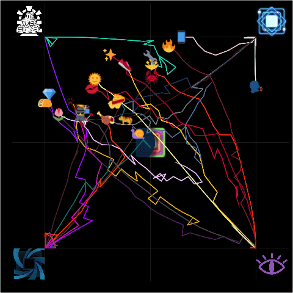

Data curtesy of `honu` on the SIBR discord server. Available [here](navigation.csv), up to Season 24 Day 54 and updated data available [here](https://faculty.sibr.dev/~honu/navigation.html).

```{r set_up}
library(tidyverse)
library(emoGG)
library(gganimate)
library(cowplot)
library(magick)
nav <- read.csv("trajectory/navigation.csv") %>% #pull(Team) %>% unique() %>% sort()
  mutate(Team = case_when(Team == "---- -------" ~ "Shoe Thieves",
                          Team == "--------" ~ "Sunbeams",
                          Team == "------------" ~ "Firefighters",
                          Team == "---------" ~ "Mechanics",
                          TRUE ~ Team),
         Emoji = case_when(Team == "Crabs" ~ "1f980",
                           Team == "Dale" ~ "1f6a4",
                           Team == "Firefighters" ~ "1f525",
                           Team == "Flowers" ~ "1f337",
                           Team == "Garages" ~ "1f3b8",
                           Team == "Georgias" ~ "1f531",
                           Team == "Jazz Hands" ~ "1f917",
                           Team == "Lift" ~ "1F3CB",
                           Team == "Lovers" ~ "1f444",
                           Team == "Magic" ~ "2728",
                           Team == "Mechanics" ~ "1f527",
                           Team == "Millennials" ~ "1f4f1",
                           Team == "Moist Talkers" ~ "1F5E3",
                           Team == "Paws" ~ "1F43E",
                           Team == "Pies" ~ "1F967",
                           Team == "Queens" ~ "1f48e",
                           Team == "Shoe Thieves" ~ "1F45F",
                           Team == "Spies" ~ "1f575",
                           Team == "Steaks" ~ "1f969",
                           Team == "Sunbeams" ~ "1F31E",
                           Team == "Tacos" ~ "1f32e",
                           Team == "Tigers" ~ "1f42f",
                           Team == "Wild Wings" ~ "1f357",
                           Team == "Worms" ~ "1f40c"))

nav
```


```{r static}
vault <- image_read("trajectory/vault.png")
pulsar <- image_read("trajectory/pulsar.png")
desert <- image_read("trajectory/desert.png")
horizon <- image_read("trajectory/horizon.png")
supernova <- image_read("trajectory/supernova.png")

nav %>% 
  ggplot(aes(x=X, y=Y)) +
  coord_fixed() +
  annotation_raster(supernova, 
                    xmin=-.15, xmax=.15, 
                    ymin=-.15, ymax=.15) +
  annotation_raster(vault, 
                    xmin=-1.3, xmax=-1, 
                    ymin=1, ymax=1.3) +
  annotation_raster(pulsar, 
                    xmin=1, xmax=1.3, 
                    ymin=1, ymax=1.3) +
  annotation_raster(horizon, 
                    xmin=-1.3, xmax=-1, 
                    ymin=-1.3, ymax=-1) +
  annotation_raster(desert, 
                    xmin=1, xmax=1.3, 
                    ymin=-1.3, ymax=-1) +
  geom_path(#arrow = arrow(angle = 15, length = unit(0.05, "inches"), ends = "last", type = "closed"),
            aes(alpha = Day,
                colour = Team)) +
  geom_emoji(data = nav[nav$Day==max(nav$Day) & nav$Team=="Crabs",],        emoji = "1f980") +
  geom_emoji(data = nav[nav$Day==max(nav$Day) & nav$Team=="Dale",],         emoji = "1f6a4") +
  geom_emoji(data = nav[nav$Day==max(nav$Day) & nav$Team=="Firefighters",], emoji = "1f525") +
  geom_emoji(data = nav[nav$Day==max(nav$Day) & nav$Team=="Flowers",],      emoji = "1f337") +
  geom_emoji(data = nav[nav$Day==max(nav$Day) & nav$Team=="Garages",],      emoji = "1f3b8") +
  geom_emoji(data = nav[nav$Day==max(nav$Day) & nav$Team=="Georgias",],     emoji = "1f531") +
  geom_emoji(data = nav[nav$Day==max(nav$Day) & nav$Team=="Jazz Hands",],   emoji = "1f450") +
  geom_emoji(data = nav[nav$Day==max(nav$Day) & nav$Team=="Lift",],         emoji = "1f3cb") +
  geom_emoji(data = nav[nav$Day==max(nav$Day) & nav$Team=="Lovers",],       emoji = "1f48b") +
  geom_emoji(data = nav[nav$Day==max(nav$Day) & nav$Team=="Magic",],        emoji = "2728") +
  geom_emoji(data = nav[nav$Day==max(nav$Day) & nav$Team=="Mechanics",],    emoji = "1f527") +
  geom_emoji(data = nav[nav$Day==max(nav$Day) & nav$Team=="Millennials",],  emoji = "1f4f1") +
  geom_emoji(data = nav[nav$Day==max(nav$Day) & nav$Team=="Moist Talkers",],emoji = "1f5e3") +
  geom_emoji(data = nav[nav$Day==max(nav$Day) & nav$Team=="Paws",],         emoji = "1f43e") +
  geom_emoji(data = nav[nav$Day==max(nav$Day) & nav$Team=="Pies",],         emoji = "1f967") +
  geom_emoji(data = nav[nav$Day==max(nav$Day) & nav$Team=="Queens",],       emoji = "1f48e") +
  geom_emoji(data = nav[nav$Day==max(nav$Day) & nav$Team=="Shoe Thieves",], emoji = "1f45f") + 
  geom_emoji(data = nav[nav$Day==max(nav$Day) & nav$Team=="Spies",],        emoji = "1f575") +
  geom_emoji(data = nav[nav$Day==max(nav$Day) & nav$Team=="Steaks",],       emoji = "1f969") +
  geom_emoji(data = nav[nav$Day==max(nav$Day) & nav$Team=="Sunbeams",],     emoji = "1f31e") +
  geom_emoji(data = nav[nav$Day==max(nav$Day) & nav$Team=="Tacos",],        emoji = "1f32e") +
  geom_emoji(data = nav[nav$Day==max(nav$Day) & nav$Team=="Tigers",],       emoji = "1f405") + 
  geom_emoji(data = nav[nav$Day==max(nav$Day) & nav$Team=="Wild Wings",],   emoji = "1f357") +
  geom_emoji(data = nav[nav$Day==max(nav$Day) & nav$Team=="Worms",],        emoji = "1f40c") +
  theme(panel.background = element_rect(fill="black"),
        plot.background =  element_rect(fill="black"),
        panel.grid.minor = element_line(colour = "gray25"),
        legend.position = "none") +
  scale_alpha_continuous(range = c(0.25, 1)) +
  scale_colour_manual(values = c("#593037", # "Crabs"
                                 "#BF00FF", # "Dale"
                                 "#8D2A3C", # "Firefighters"
                                 "#f7d1ff", # "Flowers"
                                 "#30436E", # "Garages"
                                 "#00DBC2", # "Georgias"
                                 "#6388ad", # "Jazz Hands"
                                 "#E536C8", # "Lift"
                                 "#D2264A", # "Lovers"
                                 "#BF0043", # "Magic"
                                 "#FF430A", # "Mechanics"
                                 "#F8D6D7", # "Millennials"
                                 "#e5f4f5", # "Moist Talkers"
                                 "#EBBD24", # "Paws"
                                 "#008080", # "Pies"
                                 "#9D42F5", # "Queens"
                                 "#ffce0a", # "Shoe Thieves"
                                 "#67556B", # "Spies"
                                 "#8c8d8f", # "Steaks"
                                 "#FFFBAB", # "Sunbeams"
                                 "#64376e", # "Tacos"
                                 "#5c1c1c", # "Tigers"
                                 "#FF4F00", # "Wild Wings"
                                 "#5C4822")) +# "Worms"
  scale_x_continuous(limits = c(-1.2, 1.2),
                     minor_breaks = c(-1,0,1),
                     labels = NULL,
                     breaks = NULL) +
  scale_y_continuous(limits = c(-1.2, 1.2),
                     minor_breaks = c(-1,0,1),
                     labels = NULL,
                     breaks = NULL) +
  xlab("") + ylab("")
```

```{r animated}
nav %>% 
  ggplot(aes(x=X, y=Y)) +
  annotation_raster(supernova, 
                    xmin=-.15, xmax=.15, 
                    ymin=-.15, ymax=.15) +
  annotation_raster(vault, 
                    xmin=-1.3, xmax=-1, 
                    ymin=1, ymax=1.3) +
  annotation_raster(pulsar, 
                    xmin=1, xmax=1.3, 
                    ymin=1, ymax=1.3) +
  annotation_raster(horizon, 
                    xmin=-1.3, xmax=-1, 
                    ymin=-1.3, ymax=-1) +
  annotation_raster(desert, 
                    xmin=1, xmax=1.3, 
                    ymin=-1.3, ymax=-1) +
  geom_path(aes(colour = Team,
                group = Team)) +
  geom_emoji(data = nav[nav$Team=="Crabs",],        emoji = "1f980") +
  geom_emoji(data = nav[nav$Team=="Dale",],         emoji = "1f6a4") +
  geom_emoji(data = nav[nav$Team=="Firefighters",], emoji = "1f525") +
  geom_emoji(data = nav[nav$Team=="Flowers",],      emoji = "1f337") +
  geom_emoji(data = nav[nav$Team=="Garages",],      emoji = "1f3b8") +
  geom_emoji(data = nav[nav$Team=="Georgias",],     emoji = "1f531") +
  geom_emoji(data = nav[nav$Team=="Jazz Hands",],   emoji = "1f450") +
  geom_emoji(data = nav[nav$Team=="Lift",],         emoji = "1f3cb") +
  geom_emoji(data = nav[nav$Team=="Lovers",],       emoji = "1f48b") +
  geom_emoji(data = nav[nav$Team=="Magic",],        emoji = "2728") +
  geom_emoji(data = nav[nav$Team=="Mechanics",],    emoji = "1f527") +
  geom_emoji(data = nav[nav$Team=="Millennials",],  emoji = "1f4f1") +
  geom_emoji(data = nav[nav$Team=="Moist Talkers",],emoji = "1f5e3") +
  geom_emoji(data = nav[nav$Team=="Paws",],         emoji = "1f43e") +
  geom_emoji(data = nav[nav$Team=="Pies",],         emoji = "1f967") +
  geom_emoji(data = nav[nav$Team=="Queens",],       emoji = "1f48e") +
  geom_emoji(data = nav[nav$Team=="Shoe Thieves",], emoji = "1f45f") + 
  geom_emoji(data = nav[nav$Team=="Spies",],        emoji = "1f575") +
  geom_emoji(data = nav[nav$Team=="Steaks",],       emoji = "1f969") +
  geom_emoji(data = nav[nav$Team=="Sunbeams",],     emoji = "1f31e") +
  geom_emoji(data = nav[nav$Team=="Tacos",],        emoji = "1f32e") +
  geom_emoji(data = nav[nav$Team=="Tigers",],       emoji = "1f405") + 
  geom_emoji(data = nav[nav$Team=="Wild Wings",],   emoji = "1f357") +
  geom_emoji(data = nav[nav$Team=="Worms",],        emoji = "1f40c") +
  theme(panel.background = element_rect(fill="black"),
        plot.background = element_rect(fill="black"),
        panel.grid.minor = element_line(colour = "gray25"),
        legend.position = "none") +
  scale_colour_manual(values = c("#593037", # "Crabs"
                                 "#BF00FF", # "Dale"
                                 "#8D2A3C", # "Firefighters"
                                 "#f7d1ff", # "Flowers"
                                 "#30436E", # "Garages"
                                 "#00DBC2", # "Georgias"
                                 "#6388ad", # "Jazz Hands"
                                 "#E536C8", # "Lift"
                                 "#D2264A", # "Lovers"
                                 "#BF0043", # "Magic"
                                 "#FF430A", # "Mechanics"
                                 "#F8D6D7", # "Millennials"
                                 "#e5f4f5", # "Moist Talkers"
                                 "#EBBD24", # "Paws"
                                 "#008080", # "Pies"
                                 "#9D42F5", # "Queens"
                                 "#ffce0a", # "Shoe Thieves"
                                 "#67556B", # "Spies"
                                 "#8c8d8f", # "Steaks"
                                 "#FFFBAB", # "Sunbeams"
                                 "#64376e", # "Tacos"
                                 "#5c1c1c", # "Tigers"
                                 "#FF4F00", # "Wild Wings"
                                 "#5C4822")) +# "Worms"
  scale_x_continuous(limits = c(-1.2, 1.2),
                     minor_breaks = c(-1,0,1),
                     labels = NULL,
                     breaks = NULL) +
  scale_y_continuous(limits = c(-1.2, 1.2),
                     minor_breaks = c(-1,0,1),
                     labels = NULL,
                     breaks = NULL) +
  coord_fixed() +
  xlab("") + ylab("") -> trajectory

trajectory + 
  transition_reveal(along = Day) +
  shadow_wake(wake_length = .4, exclude_layer = c(7:30)) -> trajectory_animated

trajectory_animated
```



